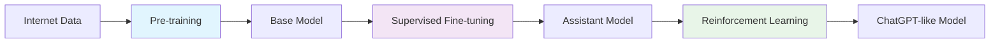
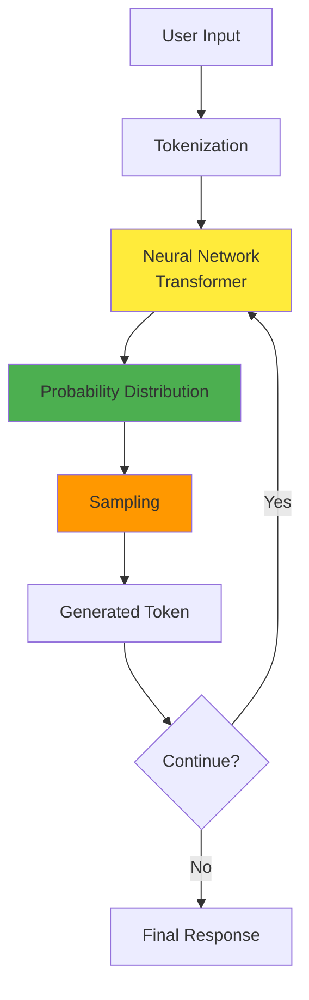

# Chapter 1: Introduction and Overview

## 🎯 What You'll Learn

- What are Large Language Models (LLMs)
- The high-level pipeline for building systems like ChatGPT
- Mental models for understanding LLM behavior
- The three main training stages

## 📖 Introduction

Large Language Models like ChatGPT appear magical - you can put anything in a text box, press enter, and get sophisticated responses. But what's actually happening behind that interface?

This chapter provides the foundational understanding of what LLMs are and how they're built.

## 🧠 Mental Model: What is an LLM?

Think of an LLM as a **very sophisticated autocomplete system**. At its core, it:

1. Takes a sequence of text (tokens)
2. Predicts what should come next
3. Samples from those predictions
4. Repeats the process

```
Input: "The capital of France is"
Prediction: [high probability for "Paris", lower for other words]
Output: "Paris"
```

## 🏗 The Three-Stage Pipeline

Building an LLM like ChatGPT involves three sequential stages:



### Stage 1: Pre-training
- **Input**: Massive amounts of internet text (books, articles, websites)
- **Process**: Train neural network to predict next word
- **Output**: Base model that understands language patterns
- **Analogy**: Like reading the entire internet to learn language

### Stage 2: Supervised Fine-tuning (SFT)
- **Input**: Curated conversations between humans and assistants
- **Process**: Teach the model to act like a helpful assistant
- **Output**: Model that can engage in conversations
- **Analogy**: Like learning specific job skills after general education

### Stage 3: Reinforcement Learning from Human Feedback (RLHF)
- **Input**: Feedback on model responses (which are better/worse)
- **Process**: Optimize for human preferences and reasoning
- **Output**: Model that can think step-by-step and reason
- **Analogy**: Like practicing and getting feedback to improve performance

## 🔄 High-Level Architecture



## 🎯 Key Insights

### 1. It's All Token Prediction
- Every word, punctuation mark, or part of a word becomes a "token"
- The model only sees sequences of numbers (token IDs)
- Generation happens one token at a time

### 2. Stochastic Nature
- Models don't always produce the same output for the same input
- They sample from probability distributions
- This creates variety but also unpredictability

### 3. No True Understanding
- Models manipulate statistical patterns in text
- They don't "understand" meaning like humans do
- They're very good at pattern matching and completion

## 🤔 Important Caveats

### Hallucinations
LLMs can generate convincing but false information because they:
- Prioritize fluency over accuracy
- Fill in gaps with plausible-sounding content
- Don't have access to real-time information

### Capabilities vs Limitations
- **Excellent at**: Pattern recognition, language tasks, creative writing
- **Poor at**: Precise calculations, recent events, true reasoning
- **Unpredictable**: Sometimes brilliant, sometimes makes basic errors

## 🎬 Real-World Analogy

Think of an LLM like a very well-read person who:
- Has read millions of books and articles
- Can discuss almost any topic
- Sometimes misremembers facts
- Speaks fluently but might confuse details
- Gets better at specific tasks with practice

## 📝 Key Terms

- **Token**: A unit of text (word, part of word, punctuation)
- **Pre-training**: Learning language patterns from internet text
- **Fine-tuning**: Specializing the model for specific tasks
- **Inference**: Generating new text from a trained model
- **Hallucination**: When models generate false but convincing information

## ❓ Questions for Reflection

1. Why do you think LLMs sometimes fail at simple tasks but excel at complex ones?
2. How might the three-stage training process affect what the model is good at?
3. What implications does the "autocomplete" nature have for how we should use these tools?

## 🔗 Next Chapter

Ready to dive deeper? In [Chapter 2](../02-data-processing/README.md), we'll explore how massive amounts of internet data are collected and processed for training.

---

*This chapter provides the conceptual foundation. The following chapters will dive into technical details of each component.*
