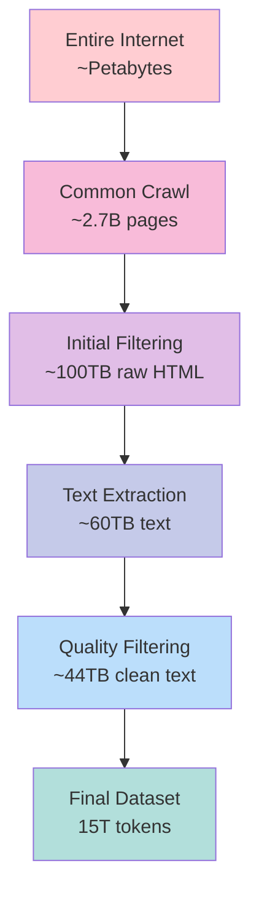
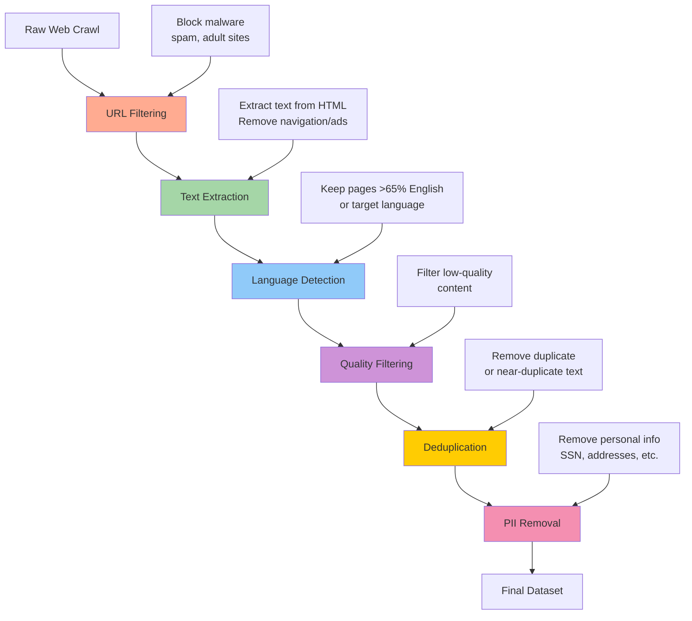
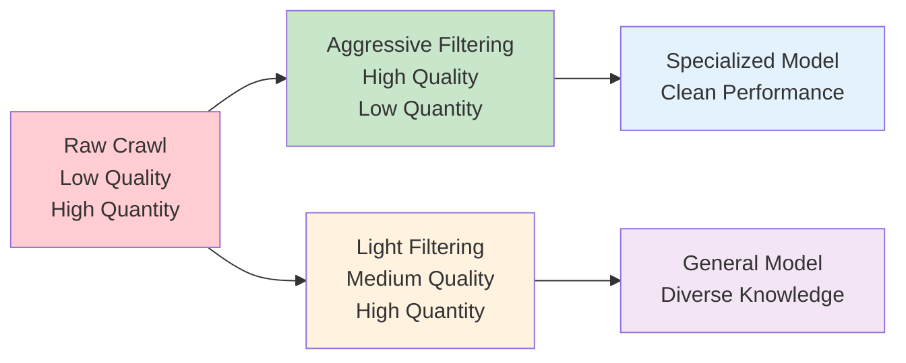

# Chapter 2: Data Collection and Processing

## 🎯 What You'll Learn

- How to collect internet-scale text data
- The filtering pipeline that transforms raw web crawls into training data
- Data quality considerations and trade-offs
- Real-world data processing challenges

## 📊 The Scale of Internet Data

The first step in building an LLM is collecting massive amounts of text. Here's what "massive" means:

- **Raw internet**: Billions of web pages
- **After filtering**: ~44 terabytes of text (FineWeb dataset)
- **Final training data**: Trillions of tokens



## 🌐 Data Sources

### Primary Source: Common Crawl
- Non-profit organization crawling the web since 2007
- Indexes ~2.7 billion web pages as of 2024
- Provides raw HTML data from websites
- Free and publicly available

### Other Sources
- **Books**: Project Gutenberg, OpenLibrary
- **Academic papers**: ArXiv, PubMed
- **Code repositories**: GitHub, StackOverflow
- **Wikipedia**: Multiple languages
- **News articles**: Various publications

## 🔄 The Data Processing Pipeline



## 🔍 Detailed Processing Steps

### 1. URL Filtering
**Purpose**: Remove unwanted domains before processing

**Filters Applied**:
- Malware and spam websites
- Adult content sites
- Marketing and commercial sites
- Racist or harmful content
- Low-quality content farms

```python
# Example blocklist categories
blocked_domains = [
    "spam-site.com",
    "malware-domain.org", 
    "low-quality-farm.net"
]

def should_process_url(url):
    domain = extract_domain(url)
    return domain not in blocked_domains
```

### 2. Text Extraction
**Purpose**: Convert HTML to clean text

**Challenges**:
- Remove HTML tags, CSS, JavaScript
- Extract main content, ignore navigation
- Handle different website structures
- Preserve formatting where important

```python
from bs4 import BeautifulSoup

def extract_text(html_content):
    soup = BeautifulSoup(html_content, 'html.parser')
    
    # Remove unwanted elements
    for element in soup(['script', 'style', 'nav', 'footer']):
        element.decompose()
    
    # Extract main text
    return soup.get_text(separator=' ', strip=True)
```

### 3. Language Detection
**Purpose**: Filter for target languages

**Method**:
- Use language detection models
- Set thresholds (e.g., >65% English)
- Balance multilingual vs. monolingual performance

```python
from langdetect import detect_langs

def is_target_language(text, target='en', threshold=0.65):
    try:
        languages = detect_langs(text)
        for lang in languages:
            if lang.lang == target and lang.prob >= threshold:
                return True
    except:
        pass
    return False
```

### 4. Quality Filtering
**Purpose**: Remove low-quality content

**Criteria**:
- Minimum text length
- Proper sentence structure
- Adequate punctuation
- Readability metrics
- Content coherence

### 5. Deduplication
**Purpose**: Remove redundant content

**Types**:
- **Exact duplicates**: Identical text
- **Near duplicates**: Very similar content
- **Substring duplicates**: One text contains another

```python
import hashlib

def create_content_hash(text):
    # Simple approach using text hash
    return hashlib.sha256(text.encode()).hexdigest()

def is_duplicate(text, seen_hashes):
    text_hash = create_content_hash(text)
    if text_hash in seen_hashes:
        return True
    seen_hashes.add(text_hash)
    return False
```

### 6. PII Removal
**Purpose**: Protect privacy and comply with regulations

**Target Information**:
- Social Security Numbers
- Phone numbers
- Email addresses
- Physical addresses
- Credit card numbers

```python
import re

def remove_pii(text):
    # Remove SSN pattern
    text = re.sub(r'\b\d{3}-\d{2}-\d{4}\b', '[SSN]', text)
    
    # Remove email addresses
    text = re.sub(r'\b[A-Za-z0-9._%+-]+@[A-Za-z0-9.-]+\.[A-Z|a-z]{2,}\b', '[EMAIL]', text)
    
    # Remove phone numbers
    text = re.sub(r'\b\d{3}-\d{3}-\d{4}\b', '[PHONE]', text)
    
    return text
```

## 📈 Data Quality vs. Quantity Trade-offs



## 🌍 Multilingual Considerations

### Language Distribution Choices
- **English-focused**: Better English performance, limited multilingual ability
- **Multilingual**: Broader language support, potentially reduced per-language quality
- **Language-specific**: Optimized for specific languages

### Impact on Model Capabilities
```python
# Example language distribution
language_distribution = {
    'english': 0.70,      # 70% English
    'chinese': 0.10,      # 10% Chinese  
    'spanish': 0.05,      # 5% Spanish
    'french': 0.04,       # 4% French
    'german': 0.03,       # 3% German
    'other': 0.08         # 8% Other languages
}
```

## 🔧 Technical Implementation

### Example Processing Pipeline

```python
class DataProcessor:
    def __init__(self):
        self.url_filter = URLFilter()
        self.text_extractor = TextExtractor()
        self.language_detector = LanguageDetector()
        self.quality_filter = QualityFilter()
        self.deduplicator = Deduplicator()
        self.pii_remover = PIIRemover()
    
    def process_crawl_data(self, crawl_files):
        processed_data = []
        
        for file_path in crawl_files:
            raw_data = self.load_crawl_file(file_path)
            
            for page in raw_data:
                # Step 1: URL filtering
                if not self.url_filter.should_process(page.url):
                    continue
                
                # Step 2: Text extraction
                text = self.text_extractor.extract(page.html)
                if not text:
                    continue
                
                # Step 3: Language detection
                if not self.language_detector.is_target_language(text):
                    continue
                
                # Step 4: Quality filtering
                if not self.quality_filter.is_high_quality(text):
                    continue
                
                # Step 5: Deduplication
                if self.deduplicator.is_duplicate(text):
                    continue
                
                # Step 6: PII removal
                clean_text = self.pii_remover.remove_pii(text)
                
                processed_data.append({
                    'url': page.url,
                    'text': clean_text,
                    'length': len(clean_text)
                })
        
        return processed_data
```

## 📊 Real-World Example: FineWeb Dataset

The FineWeb dataset (by Hugging Face) is a good example of production-grade data processing:

### Statistics
- **Source**: CommonCrawl snapshots
- **Raw size**: ~100TB of HTML
- **Final size**: 44TB of clean text
- **Tokens**: ~15 trillion tokens
- **Languages**: Primarily English (>65%)

### Key Features
- Aggressive deduplication
- High-quality filtering
- PII removal
- Multiple processing stages
- Public availability for research

## ⚠️ Challenges and Considerations

### 1. Legal and Ethical Issues
- Copyright concerns with web content
- Privacy implications of personal data
- Fair use considerations
- Terms of service violations

### 2. Quality Control
- Balancing aggressive filtering with data retention
- Handling edge cases in automated filtering
- Ensuring diverse representation
- Avoiding bias amplification

### 3. Technical Challenges
- Processing internet-scale data efficiently
- Storage and bandwidth requirements
- Handling different file formats and encodings
- Managing data pipeline failures

## 💡 Best Practices

1. **Start with quality over quantity**
2. **Implement multiple filtering stages**
3. **Preserve data lineage and provenance**
4. **Regular quality audits of processed data**
5. **Consider legal and ethical implications**
6. **Plan for data freshness and updates**

## ❓ Questions for Reflection

1. How might aggressive filtering affect model capabilities?
2. What are the trade-offs between multilingual and monolingual datasets?
3. How would you handle biased or harmful content in training data?
4. What privacy considerations are important in large-scale data collection?

## 🔗 Next Chapter

Now that we have clean text data, we need to convert it into a format neural networks can process. In [Chapter 3](../03-tokenization/README.md), we'll explore tokenization - the process of converting text into sequences of tokens.

---

*The quality of your training data fundamentally determines the quality of your model. Garbage in, garbage out.*
