# Chapter 3: Tokenization

## 🎯 What You'll Learn

- Why neural networks need tokenization
- The evolution from characters to subwords
- How Byte Pair Encoding (BPE) works
- Practical implications of tokenization choices
- Hands-on tokenization examples

## 🤖 Why Tokenization?

Neural networks expect:
- **Fixed vocabulary size**: Limited number of possible symbols
- **Numerical inputs**: Sequences of integers, not text
- **Manageable sequence lengths**: Shorter sequences are easier to process


## 📈 Evolution of Tokenization

### Character-Level Tokenization
```
Text: "Hello"
Tokens: ["H", "e", "l", "l", "o"]
Vocabulary size: ~100 (all characters)
Sequence length: Very long
```

**Pros**: Small vocabulary, handles any text
**Cons**: Very long sequences, limited context

### Word-Level Tokenization  
```
Text: "Hello world"
Tokens: ["Hello", "world"]
Vocabulary size: ~50,000-100,000 words
Sequence length: Moderate
```

**Pros**: Meaningful units, shorter sequences
**Cons**: Large vocabulary, can't handle new words

### Subword Tokenization (BPE) - **Modern Approach**
```
Text: "Hello world"
Tokens: ["Hello", " world"]
Vocabulary size: ~32,000-100,000 subwords
Sequence length: Optimal balance
```

**Pros**: Balances vocabulary size and sequence length
**Cons**: Slightly more complex

```mermaid
graph TD
    A[Text Processing Evolution] --> B[Character Level<br/>Small vocab<br/>Long sequences]
    A --> C[Word Level<br/>Large vocab<br/>Medium sequences]  
    A --> D[Subword Level BPE<br/>Medium vocab<br/>Short sequences]
    
    B --> E[❌ Too many tokens<br/>Limited context]
    C --> F[❌ Unknown words<br/>Huge vocabulary]
    D --> G[✅ Optimal balance<br/>Modern choice]
    
    style D fill:#4caf50
    style G fill:#81c784
```



## 🔧 Byte Pair Encoding (BPE) Algorithm

BPE is the most common tokenization method for modern LLMs. It works by iteratively merging the most frequent pairs of tokens.

### Step-by-Step Process


### Example: Training BPE

Let's train BPE on a simple corpus:

**Initial corpus:**
```
"low" → ['l', 'o', 'w']
"lower" → ['l', 'o', 'w', 'e', 'r'] 
"newest" → ['n', 'e', 'w', 'e', 's', 't']
"widest" → ['w', 'i', 'd', 'e', 's', 't']
```

**Iteration 1:** Count pairs
```
('l', 'o'): 2 times
('o', 'w'): 2 times  ← Most frequent
('w', 'e'): 2 times  ← Most frequent
('e', 's'): 2 times  ← Most frequent
('s', 't'): 2 times  ← Most frequent
```

**Merge ('e', 's') → 'es':**
```
"low" → ['l', 'o', 'w']
"lower" → ['l', 'o', 'w', 'e', 'r']
"newest" → ['n', 'e', 'w', 'es', 't']
"widest" → ['w', 'i', 'd', 'es', 't']
```

**Continue merging until target vocabulary size...**

### Python Implementation

```python
import re
from collections import Counter
from typing import Dict, List, Tuple, Set
import logging

logger = logging.getLogger(__name__)

class BPETokenizer:
    """Byte Pair Encoding tokenizer with proper error handling and type hints.
    
    This implementation follows SWE best practices including:
    - Comprehensive type hints
    - Proper error handling  
    - Input validation
    - Logging for debugging
    """
    
    def __init__(self, vocab_size: int = 1000):
        """Initialize BPE tokenizer.
        
        Args:
            vocab_size: Target vocabulary size
            
        Raises:
            ValueError: If vocab_size is invalid
        """
        if vocab_size <= 0:
            raise ValueError("vocab_size must be positive")
        if vocab_size > 100000:
            raise ValueError("vocab_size too large, consider smaller value")
            
        self.vocab_size = vocab_size
        self.word_tokenizer = re.compile(r'\w+|\W')
        self.vocab: Dict[str, int] = {}
        self.merges: List[Tuple[str, str]] = []
    
    def get_word_tokens(self, text: str) -> Dict[Tuple[str, ...], int]:
        """Split text into words and convert to character lists.
        
        Args:
            text: Input text to tokenize
            
        Returns:
            Dictionary mapping word tuples to their frequencies
            
        Raises:
            ValueError: If text is empty
        """
        if not text.strip():
            raise ValueError("Input text cannot be empty")
            
        words = self.word_tokenizer.findall(text.lower())
        word_frequencies = Counter(words)
        
        return {
            tuple(word + '</w>'): freq 
            for word, freq in word_frequencies.items()
        }
    
    def get_pairs(self, word_tokens: Dict[Tuple[str, ...], int]) -> Counter:
        """Get all adjacent pairs and their frequencies.
        
        Args:
            word_tokens: Word token frequency mapping
            
        Returns:
            Counter of adjacent pair frequencies
        """
        pairs = Counter()
        
        for word, freq in word_tokens.items():
            for i in range(len(word) - 1):
                pairs[(word[i], word[i + 1])] += freq
        
        return pairs
    
    def merge_vocab(self, pair: Tuple[str, str], 
                   word_tokens: Dict[Tuple[str, ...], int]) -> Dict[Tuple[str, ...], int]:
        """Merge the most frequent pair in vocabulary.
        
        Args:
            pair: Pair to merge
            word_tokens: Current word token mapping
            
        Returns:
            Updated word token mapping
        """
        new_word_tokens = {}
        bigram = re.escape(' '.join(pair))
        pattern = re.compile(r'(?<!\S)' + bigram + r'(?!\S)')
        
        for word in word_tokens:
            new_word = pattern.sub(''.join(pair), ' '.join(word))
            new_word_tokens[tuple(new_word.split())] = word_tokens[word]
        
        return new_word_tokens
    
    def train(self, text: str) -> Tuple[Dict[str, int], List[Tuple[str, str]]]:
        """Train BPE on given text.
        
        Args:
            text: Training text corpus
            
        Returns:
            Tuple of (vocabulary, merges)
            
        Raises:
            ValueError: If text is invalid
            RuntimeError: If training fails
        """
        if not text or not text.strip():
            raise ValueError("Training text cannot be empty")
        
        if len(text) < 100:
            import warnings
            warnings.warn("Training text is very short, results may be poor")
        
        try:
            logger.info(f"Starting BPE training with vocab_size={self.vocab_size}")
            
            # Initialize with character-level tokens
            word_tokens = self.get_word_tokens(text)
            
            # Get initial vocabulary (all characters)
            vocab: Set[str] = set()
            for word in word_tokens:
                vocab.update(word)
            
            initial_vocab_size = len(vocab)
            logger.info(f"Initial vocabulary size: {initial_vocab_size}")
            
            # Iteratively merge most frequent pairs
            for iteration in range(self.vocab_size - len(vocab)):
                pairs = self.get_pairs(word_tokens)
                
                if not pairs:
                    logger.warning("No more pairs to merge, stopping early")
                    break
                
                # Get most frequent pair
                best_pair = pairs.most_common(1)[0][0]
                
                # Merge the pair
                word_tokens = self.merge_vocab(best_pair, word_tokens)
                self.merges.append(best_pair)
                vocab.add(''.join(best_pair))
                
                if iteration % 100 == 0:
                    logger.info(f"Iteration {iteration}: merged {best_pair}")
        
            # Create final vocabulary with IDs
            self.vocab = {token: i for i, token in enumerate(sorted(vocab))}
            
            logger.info(f"Training completed. Final vocab size: {len(self.vocab)}")
            return self.vocab, self.merges
            
        except Exception as e:
            logger.error(f"Training failed: {e}")
            raise RuntimeError(f"BPE training failed: {e}") from e
    
    def encode(self, text: str) -> List[int]:
        """Encode text using trained BPE.
        
        Args:
            text: Text to encode
            
        Returns:
            List of token IDs
            
        Raises:
            ValueError: If text is invalid or tokenizer not trained
        """
        if not text:
            return []
            
        if not self.vocab:
            raise ValueError("Tokenizer must be trained before encoding")
        
        tokens = []
        words = self.word_tokenizer.findall(text.lower())
        
        for word in words:
            word_tokens = list(word + '</w>')
            
            # Apply merges in order
            for pair in self.merges:
                if len(word_tokens) == 1:
                    break
                
                i = 0
                while i < len(word_tokens) - 1:
                    if (word_tokens[i], word_tokens[i + 1]) == pair:
                        word_tokens = (word_tokens[:i] + 
                                     [''.join(pair)] + 
                                     word_tokens[i + 2:])
                    else:
                        i += 1
            
            # Convert to IDs
            for token in word_tokens:
                if token in self.vocab:
                    tokens.append(self.vocab[token])
                else:
                    logger.warning(f"Unknown token: {token}")
        
        return tokens
    
    def decode(self, token_ids: List[int]) -> str:
        """Decode token IDs back to text.
        
        Args:
            token_ids: List of token IDs
            
        Returns:
            Decoded text
            
        Raises:
            ValueError: If tokenizer not trained
        """
        if not self.vocab:
            raise ValueError("Tokenizer must be trained before decoding")
        
        # Create reverse vocabulary
        id_to_token = {i: token for token, i in self.vocab.items()}
        
        tokens = []
        for token_id in token_ids:
            if token_id in id_to_token:
                tokens.append(id_to_token[token_id])
            else:
                logger.warning(f"Unknown token ID: {token_id}")
        
        # Join tokens and remove end-of-word markers
        text = ''.join(tokens).replace('</w>', ' ')
        return text.strip()

# Example usage with proper error handling
try:
    tokenizer = BPETokenizer(vocab_size=500)
    text = "This is a sample text for tokenization training."
    
    vocab, merges = tokenizer.train(text)
    tokens = tokenizer.encode("This is new text")
    decoded = tokenizer.decode(tokens)
    
    print(f"Original: This is new text")
    print(f"Tokens: {tokens}")
    print(f"Decoded: {decoded}")
    
except ValueError as e:
    print(f"Input error: {e}")
except RuntimeError as e:
    print(f"Training error: {e}")
```

## 🎛 Modern Tokenization: tiktoken

GPT models use the `tiktoken` library. Let's explore how it works:

```python
import tiktoken
from typing import List, Optional
import logging

logger = logging.getLogger(__name__)

class ModernTokenizerWrapper:
    """Wrapper for modern tokenizers like tiktoken with enhanced functionality."""
    
    def __init__(self, model_name: str = "gpt-4"):
        """Initialize tokenizer for specified model.
        
        Args:
            model_name: Name of the model (e.g., "gpt-4", "gpt-3.5-turbo")
            
        Raises:
            ValueError: If model not supported
        """
        try:
            self.encoding = tiktoken.encoding_for_model(model_name)
            self.model_name = model_name
            logger.info(f"Loaded tokenizer for {model_name}")
        except KeyError:
            raise ValueError(f"Model {model_name} not supported by tiktoken")
    
    def encode_with_validation(self, text: str, 
                             max_tokens: Optional[int] = None) -> List[int]:
        """Encode text with optional length validation.
        
        Args:
            text: Text to encode
            max_tokens: Maximum allowed tokens (None for no limit)
            
        Returns:
            List of token IDs
            
        Raises:
            ValueError: If text is too long
        """
        if not text:
            return []
        
        tokens = self.encoding.encode(text)
        
        if max_tokens and len(tokens) > max_tokens:
            raise ValueError(
                f"Text too long: {len(tokens)} tokens > {max_tokens} limit"
            )
        
        return tokens
    
    def analyze_tokenization(self, text: str) -> dict:
        """Provide comprehensive tokenization analysis.
        
        Args:
            text: Text to analyze
            
        Returns:
            Dictionary with analysis results
        """
        tokens = self.encoding.encode(text)
        
        analysis = {
            'text': text,
            'character_count': len(text),
            'token_count': len(tokens),
            'compression_ratio': len(text) / len(tokens) if tokens else 0,
            'tokens': tokens,
            'token_breakdown': []
        }
        
        # Add detailed token breakdown
        for i, token in enumerate(tokens):
            token_text = self.encoding.decode([token])
            analysis['token_breakdown'].append({
                'index': i,
                'token_id': token,
                'token_text': repr(token_text),  # Use repr to show special chars
                'byte_length': len(token_text.encode('utf-8'))
            })
        
        return analysis

# Example usage with comprehensive analysis
try:
    tokenizer = ModernTokenizerWrapper("gpt-4")
    
    test_texts = [
        "Hello, world! This is a test.",
        "The quick brown fox jumps over the lazy dog.",
        "🤖 AI tokenization with emojis! 🚀",
        "Code example: def hello(): print('Hello, World!')"
    ]
    
    for text in test_texts:
        analysis = tokenizer.analyze_tokenization(text)
        
        print(f"\n{'='*50}")
        print(f"Text: {analysis['text']}")
        print(f"Characters: {analysis['character_count']}")
        print(f"Tokens: {analysis['token_count']}")
        print(f"Compression: {analysis['compression_ratio']:.2f} chars/token")
        print("\nToken breakdown:")
        
        for token_info in analysis['token_breakdown']:
            print(f"  {token_info['index']:2d}: {token_info['token_id']:5d} -> "
                  f"{token_info['token_text']:15s} ({token_info['byte_length']} bytes)")

except Exception as e:
    logger.error(f"Tokenization analysis failed: {e}")
```

## 📊 Tokenization Analysis Tool

```python
from typing import Dict, List, Union
import matplotlib.pyplot as plt
import pandas as pd

class TokenizationAnalyzer:
    """Advanced tokenization analysis and comparison tool."""
    
    def __init__(self):
        """Initialize analyzer with support for multiple tokenizers."""
        self.tokenizers = {}
        self._load_available_tokenizers()
    
    def _load_available_tokenizers(self) -> None:
        """Load all available tokenizers."""
        try:
            import tiktoken
            models = ["gpt-4", "gpt-3.5-turbo", "text-davinci-003"]
            for model in models:
                try:
                    self.tokenizers[model] = tiktoken.encoding_for_model(model)
                except:
                    continue
        except ImportError:
            logger.warning("tiktoken not available")
    
    def compare_tokenizers(self, text: str, 
                          models: List[str] = None) -> pd.DataFrame:
        """Compare tokenization across different models.
        
        Args:
            text: Text to analyze
            models: List of model names to compare
            
        Returns:
            DataFrame with comparison results
        """
        if models is None:
            models = list(self.tokenizers.keys())
        
        results = []
        
        for model in models:
            if model not in self.tokenizers:
                continue
                
            tokens = self.tokenizers[model].encode(text)
            
            results.append({
                'model': model,
                'token_count': len(tokens),
                'compression_ratio': len(text) / len(tokens) if tokens else 0,
                'avg_chars_per_token': len(text) / len(tokens) if tokens else 0,
                'vocab_efficiency': self._calculate_vocab_efficiency(tokens)
            })
        
        return pd.DataFrame(results)
    
    def _calculate_vocab_efficiency(self, tokens: List[int]) -> float:
        """Calculate vocabulary usage efficiency."""
        if not tokens:
            return 0.0
        unique_tokens = len(set(tokens))
        return unique_tokens / len(tokens)
    
    def analyze_text_properties(self, text: str, model: str = "gpt-4") -> Dict:
        """Analyze how text properties affect tokenization.
        
        Args:
            text: Text to analyze
            model: Model to use for tokenization
            
        Returns:
            Dictionary with detailed analysis
        """
        if model not in self.tokenizers:
            raise ValueError(f"Model {model} not available")
        
        tokenizer = self.tokenizers[model]
        tokens = tokenizer.encode(text)
        
        # Character-level analysis
        char_types = {
            'letters': sum(c.isalpha() for c in text),
            'digits': sum(c.isdigit() for c in text),
            'spaces': sum(c.isspace() for c in text),
            'punctuation': sum(not c.isalnum() and not c.isspace() for c in text),
            'unicode_special': sum(ord(c) > 127 for c in text)
        }
        
        # Token-level analysis
        token_lengths = []
        for token in tokens:
            token_text = tokenizer.decode([token])
            token_lengths.append(len(token_text))
        
        return {
            'basic_stats': {
                'text_length': len(text),
                'token_count': len(tokens),
                'compression_ratio': len(text) / len(tokens) if tokens else 0
            },
            'character_composition': char_types,
            'token_stats': {
                'avg_token_length': sum(token_lengths) / len(token_lengths) if token_lengths else 0,
                'min_token_length': min(token_lengths) if token_lengths else 0,
                'max_token_length': max(token_lengths) if token_lengths else 0,
                'unique_tokens': len(set(tokens))
            }
        }
    
    def visualize_tokenization(self, text: str, model: str = "gpt-4") -> None:
        """Create visualization of tokenization process.
        
        Args:
            text: Text to visualize
            model: Model to use
        """
        if model not in self.tokenizers:
            raise ValueError(f"Model {model} not available")
        
        tokenizer = self.tokenizers[model]
        tokens = tokenizer.encode(text)
        
        # Create token breakdown visualization
        fig, (ax1, ax2) = plt.subplots(2, 1, figsize=(12, 8))
        
        # Token length distribution
        token_lengths = [len(tokenizer.decode([token])) for token in tokens]
        ax1.hist(token_lengths, bins=20, alpha=0.7, color='skyblue', edgecolor='black')
        ax1.set_xlabel('Token Length (characters)')
        ax1.set_ylabel('Frequency')
        ax1.set_title(f'Token Length Distribution - {model}')
        ax1.grid(True, alpha=0.3)
        
        # Compression ratio over text length
        ratios = []
        for i in range(1, len(text) + 1):
            substring = text[:i]
            sub_tokens = tokenizer.encode(substring)
            ratio = len(substring) / len(sub_tokens) if sub_tokens else 0
            ratios.append(ratio)
        
        ax2.plot(range(1, len(text) + 1), ratios, color='coral', linewidth=2)
        ax2.set_xlabel('Text Length (characters)')
        ax2.set_ylabel('Compression Ratio')
        ax2.set_title('Compression Ratio vs Text Length')
        ax2.grid(True, alpha=0.3)
        
        plt.tight_layout()
        plt.show()
        
        # Print detailed breakdown
        print(f"\nDetailed Tokenization Breakdown for: '{text[:50]}...'")
        print(f"Model: {model}")
        print(f"Total characters: {len(text)}")
        print(f"Total tokens: {len(tokens)}")
        print(f"Compression ratio: {len(text) / len(tokens):.2f}")
        print("\nFirst 10 tokens:")
        
        for i, token in enumerate(tokens[:10]):
            token_text = tokenizer.decode([token])
            print(f"  {i:2d}: {token:5d} -> {repr(token_text):15s}")

# Example usage
analyzer = TokenizationAnalyzer()

# Compare different models
text = "The quick brown fox jumps over the lazy dog. This is a test of tokenization!"
comparison = analyzer.compare_tokenizers(text)
print("Model Comparison:")
print(comparison.to_string(index=False))

# Detailed analysis
analysis = analyzer.analyze_text_properties(text)
print(f"\nDetailed Analysis:")
for category, data in analysis.items():
    print(f"\n{category.upper()}:")
    if isinstance(data, dict):
        for key, value in data.items():
            print(f"  {key}: {value}")
    else:
        print(f"  {data}")

# Visualization (uncomment to run)
# analyzer.visualize_tokenization(text)
```
    
    for i, token in enumerate(tokens):
        token_text = enc.decode([token])
        print(f"  {i:2d}: {token:5d} → '{token_text}'")

# Test different types of text
texts = [
    "Hello world!",
    "The quick brown fox jumps over the lazy dog.",
    "你好世界",  # Chinese
    "print('Hello, world!')",  # Code
    "supercalifragilisticexpialidocious"  # Long word
]

for text in texts:
    analyze_tokenization(text)
    print("-" * 50)
```

## 🌍 Multilingual Tokenization

Different languages have different tokenization characteristics:


```python
# Tokenization efficiency across languages
texts = {
    "English": "The quick brown fox jumps over the lazy dog.",
    "Chinese": "狐狸跳过了懒惰的狗。",
    "German": "Der schnelle braune Fuchs springt über den faulen Hund.",
    "Japanese": "素早い茶色のキツネが怠惰な犬を飛び越えます。"
}

enc = tiktoken.encoding_for_model("gpt-4")

for language, text in texts.items():
    tokens = enc.encode(text)
    ratio = len(text) / len(tokens)
    print(f"{language:8s}: {len(tokens):2d} tokens, {ratio:.2f} chars/token")
```

## ⚙️ Practical Implications

### 1. Context Length Limitations
```python
# GPT-4 has ~8K token context limit
max_tokens = 8192
text = "Very long document..."
tokens = enc.encode(text)

if len(tokens) > max_tokens:
    print(f"Text too long! {len(tokens)} > {max_tokens}")
    # Need to truncate or split
    truncated_tokens = tokens[:max_tokens]
    truncated_text = enc.decode(truncated_tokens)
```

### 2. Cost Implications
```python
# API pricing is often per token
def estimate_cost(text, cost_per_1k_tokens=0.01):
    tokens = enc.encode(text)
    cost = (len(tokens) / 1000) * cost_per_1k_tokens
    return len(tokens), cost

token_count, estimated_cost = estimate_cost("Your text here")
print(f"Tokens: {token_count}, Estimated cost: ${estimated_cost:.4f}")
```

### 3. Token Boundary Effects
```python
# Tokenization can affect model understanding
examples = [
    "NewYork",      # Might be one token
    "New York",     # Might be two tokens  
    " NewYork",     # Leading space changes tokenization
    "NEW YORK"      # Capitalization matters
]

for text in examples:
    tokens = enc.encode(text)
    print(f"'{text}' → {tokens} ({len(tokens)} tokens)")
```

## 🔍 Advanced Topics

### Special Tokens
```python
# Many tokenizers have special tokens
special_tokens = {
    "<|endoftext|>": "End of document",
    "<|im_start|>": "Start of message", 
    "<|im_end|>": "End of message",
    "<pad>": "Padding token",
    "<unk>": "Unknown token"
}
```

### Subword Regularization
Some tokenizers use probabilistic tokenization to improve robustness:

```python
# Example: SentencePiece with subword regularization
# This creates multiple possible tokenizations for the same text
# helping the model be more robust to variations
```

## 🎯 Best Practices

1. **Understand your tokenizer**: Know how it handles your specific use case
2. **Monitor token usage**: Track costs and context limits
3. **Handle edge cases**: Long words, special characters, multilingual text
4. **Preprocessing consistency**: Use same tokenization for training and inference
5. **Vocabulary coverage**: Ensure important terms aren't over-split

## ❓ Questions for Reflection

1. How might tokenization differences affect model performance across languages?
2. Why do leading spaces matter in tokenization?
3. How would you handle a document that exceeds the context limit?
4. What are the trade-offs between smaller vs. larger vocabulary sizes?

## 🔗 Next Chapter

Now that we understand how text becomes tokens, we're ready to explore the neural network architecture that processes these tokens. In [Chapter 4](../04-architecture/README.md), we'll dive into the Transformer architecture.

---

*Tokenization is where the rubber meets the road - it's the bridge between human language and machine learning.*
