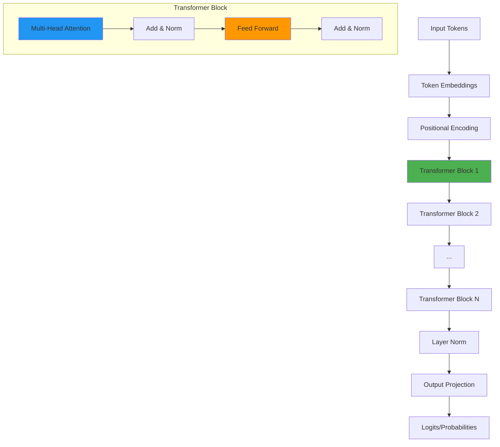
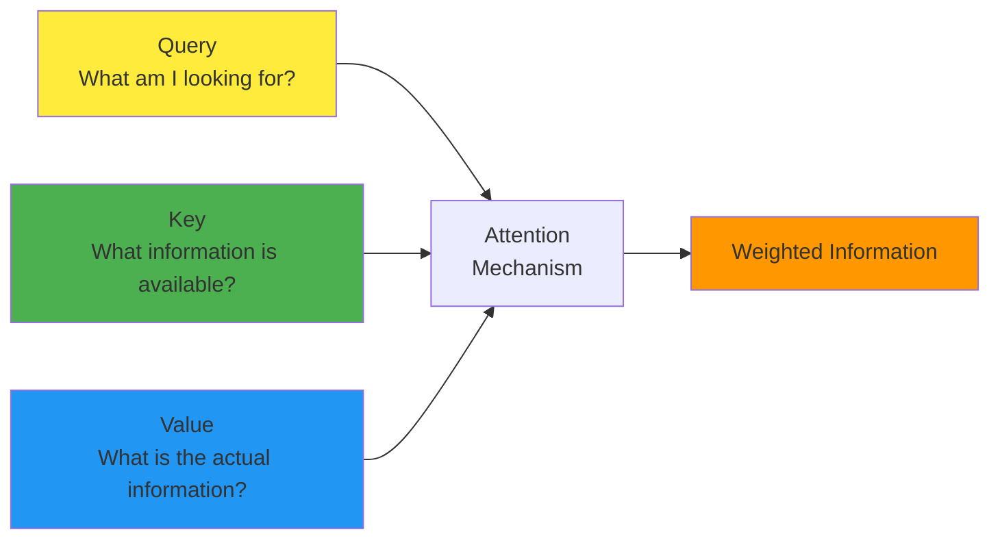
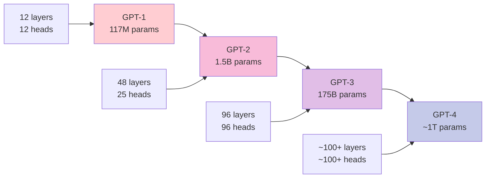

# Chapter 4: Neural Network Architecture - The Transformer

## 🎯 What You'll Learn

- The Transformer architecture that powers modern LLMs
- How attention mechanisms work
- The role of embeddings, layers, and parameters
- Why Transformers are so effective for language
- Hands-on implementation concepts

## 🏗 The Transformer Architecture

The Transformer is the neural network architecture that revolutionized NLP and powers all modern LLMs including GPT, BERT, and T5.



## 🧠 Core Components

### 1. Token Embeddings
Convert token IDs into dense vector representations:

```python
import torch
import torch.nn as nn

class TokenEmbedding(nn.Module):
    def __init__(self, vocab_size, embed_dim):
        super().__init__()
        self.embedding = nn.Embedding(vocab_size, embed_dim)
        self.embed_dim = embed_dim
    
    def forward(self, tokens):
        # Scale embeddings by sqrt(embed_dim) for stability
        return self.embedding(tokens) * (self.embed_dim ** 0.5)

# Example
vocab_size = 50000  # Size of vocabulary
embed_dim = 768     # Embedding dimension
embedding_layer = TokenEmbedding(vocab_size, embed_dim)

# Convert token IDs to embeddings
tokens = torch.tensor([1, 15, 42, 100])  # Example token IDs
embeddings = embedding_layer(tokens)
print(f"Token shape: {tokens.shape}")
print(f"Embedding shape: {embeddings.shape}")
```

### 2. Positional Encoding
Since Transformers have no inherent notion of sequence order, we need to inject positional information:

```python
import math

class PositionalEncoding(nn.Module):
    def __init__(self, embed_dim, max_len=5000):
        super().__init__()
        
        # Create positional encoding matrix
        pe = torch.zeros(max_len, embed_dim)
        position = torch.arange(0, max_len).unsqueeze(1).float()
        
        # Create sinusoidal patterns
        div_term = torch.exp(torch.arange(0, embed_dim, 2).float() *
                           -(math.log(10000.0) / embed_dim))
        
        pe[:, 0::2] = torch.sin(position * div_term)  # Even indices
        pe[:, 1::2] = torch.cos(position * div_term)  # Odd indices
        
        pe = pe.unsqueeze(0)  # Add batch dimension
        self.register_buffer('pe', pe)
    
    def forward(self, x):
        seq_len = x.size(1)
        return x + self.pe[:, :seq_len]

# Example
pos_encoding = PositionalEncoding(embed_dim=768)
embeddings_with_pos = pos_encoding(embeddings.unsqueeze(0))
```

## 🎯 The Heart: Multi-Head Attention

Attention is the key innovation that makes Transformers so powerful. It allows the model to focus on different parts of the input when processing each token.

### Understanding Attention



### Mathematical Foundation

Attention computes:
**Attention(Q, K, V) = softmax(QK^T / √d_k)V**

Where:
- Q = Queries (what we're looking for)
- K = Keys (what's available to match against)
- V = Values (the actual information to retrieve)

```python
class MultiHeadAttention(nn.Module):
    def __init__(self, embed_dim, num_heads):
        super().__init__()
        assert embed_dim % num_heads == 0
        
        self.embed_dim = embed_dim
        self.num_heads = num_heads
        self.head_dim = embed_dim // num_heads
        
        # Linear projections for Q, K, V
        self.q_proj = nn.Linear(embed_dim, embed_dim)
        self.k_proj = nn.Linear(embed_dim, embed_dim)
        self.v_proj = nn.Linear(embed_dim, embed_dim)
        self.out_proj = nn.Linear(embed_dim, embed_dim)
        
        # Scaling factor for numerical stability
        self.scale = self.head_dim ** -0.5
    
    def forward(self, x, mask=None):
        batch_size, seq_len, embed_dim = x.shape
        
        # Generate Q, K, V
        q = self.q_proj(x)  # (batch, seq_len, embed_dim)
        k = self.k_proj(x)
        v = self.v_proj(x)
        
        # Reshape for multi-head attention
        q = q.view(batch_size, seq_len, self.num_heads, self.head_dim).transpose(1, 2)
        k = k.view(batch_size, seq_len, self.num_heads, self.head_dim).transpose(1, 2)
        v = v.view(batch_size, seq_len, self.num_heads, self.head_dim).transpose(1, 2)
        # Shape: (batch, num_heads, seq_len, head_dim)
        
        # Compute attention scores
        scores = torch.matmul(q, k.transpose(-2, -1)) * self.scale
        # Shape: (batch, num_heads, seq_len, seq_len)
        
        # Apply causal mask for autoregressive generation
        if mask is not None:
            scores.masked_fill_(mask == 0, -float('inf'))
        
        # Apply softmax to get attention weights
        attn_weights = torch.softmax(scores, dim=-1)
        
        # Apply attention to values
        attn_output = torch.matmul(attn_weights, v)
        # Shape: (batch, num_heads, seq_len, head_dim)
        
        # Concatenate heads and project
        attn_output = attn_output.transpose(1, 2).contiguous().view(
            batch_size, seq_len, embed_dim)
        
        return self.out_proj(attn_output)

# Example usage
attention = MultiHeadAttention(embed_dim=768, num_heads=12)
output = attention(embeddings_with_pos)
print(f"Attention output shape: {output.shape}")
```

### Visualizing Attention

```python
def visualize_attention_pattern():
    """
    Simple visualization of attention patterns
    """
    # Example attention weights for sequence "The cat sat on the mat"
    tokens = ["The", "cat", "sat", "on", "the", "mat"]
    
    # Simplified attention matrix (6x6)
    attention_matrix = torch.tensor([
        [0.8, 0.1, 0.05, 0.02, 0.02, 0.01],  # "The" attends mostly to itself
        [0.2, 0.6, 0.1, 0.05, 0.03, 0.02],   # "cat" attends to "The" and itself
        [0.1, 0.3, 0.4, 0.1, 0.05, 0.05],    # "sat" attends to "cat"
        [0.05, 0.1, 0.2, 0.5, 0.1, 0.05],    # "on" 
        [0.3, 0.05, 0.05, 0.1, 0.4, 0.1],    # "the" (second)
        [0.1, 0.4, 0.1, 0.2, 0.1, 0.1]       # "mat" attends to "cat"
    ])
    
    print("Attention Pattern (rows = from, cols = to):")
    print("Tokens:", tokens)
    for i, token in enumerate(tokens):
        attention_str = " ".join([f"{w:.2f}" for w in attention_matrix[i]])
        print(f"{token:4s}: {attention_str}")

visualize_attention_pattern()
```

## 🔧 Feed Forward Networks

After attention, each position is processed independently through a feed-forward network:

```python
class FeedForward(nn.Module):
    def __init__(self, embed_dim, ff_dim, dropout=0.1):
        super().__init__()
        self.linear1 = nn.Linear(embed_dim, ff_dim)
        self.linear2 = nn.Linear(ff_dim, embed_dim)
        self.dropout = nn.Dropout(dropout)
        self.activation = nn.GELU()  # Gaussian Error Linear Unit
    
    def forward(self, x):
        # First projection with activation
        x = self.linear1(x)
        x = self.activation(x)
        x = self.dropout(x)
        
        # Second projection back to original dimension
        x = self.linear2(x)
        return x

# Example
ff_network = FeedForward(embed_dim=768, ff_dim=3072)
ff_output = ff_network(output)
print(f"Feed forward output shape: {ff_output.shape}")
```

## 🔗 Putting It Together: Transformer Block

```python
class TransformerBlock(nn.Module):
    def __init__(self, embed_dim, num_heads, ff_dim, dropout=0.1):
        super().__init__()
        self.attention = MultiHeadAttention(embed_dim, num_heads)
        self.feed_forward = FeedForward(embed_dim, ff_dim, dropout)
        self.ln1 = nn.LayerNorm(embed_dim)
        self.ln2 = nn.LayerNorm(embed_dim)
        self.dropout = nn.Dropout(dropout)
    
    def forward(self, x, mask=None):
        # Pre-norm attention with residual connection
        attn_out = self.attention(self.ln1(x), mask)
        x = x + self.dropout(attn_out)
        
        # Pre-norm feed forward with residual connection
        ff_out = self.feed_forward(self.ln2(x))
        x = x + self.dropout(ff_out)
        
        return x

# Example transformer block
transformer_block = TransformerBlock(
    embed_dim=768, 
    num_heads=12, 
    ff_dim=3072
)
block_output = transformer_block(embeddings_with_pos)
print(f"Transformer block output: {block_output.shape}")
```

## 🏛 Complete GPT-Style Model

```python
class GPTModel(nn.Module):
    def __init__(self, vocab_size, embed_dim, num_heads, num_layers, 
                 max_len, ff_dim, dropout=0.1):
        super().__init__()
        
        # Embeddings
        self.token_embedding = TokenEmbedding(vocab_size, embed_dim)
        self.pos_encoding = PositionalEncoding(embed_dim, max_len)
        
        # Transformer blocks
        self.blocks = nn.ModuleList([
            TransformerBlock(embed_dim, num_heads, ff_dim, dropout)
            for _ in range(num_layers)
        ])
        
        # Output layers
        self.ln_final = nn.LayerNorm(embed_dim)
        self.head = nn.Linear(embed_dim, vocab_size, bias=False)
        
        # Initialize weights
        self.apply(self._init_weights)
    
    def _init_weights(self, module):
        if isinstance(module, nn.Linear):
            torch.nn.init.normal_(module.weight, mean=0.0, std=0.02)
            if module.bias is not None:
                torch.nn.init.zeros_(module.bias)
        elif isinstance(module, nn.Embedding):
            torch.nn.init.normal_(module.weight, mean=0.0, std=0.02)
    
    def forward(self, tokens, targets=None):
        # Get embeddings with position encoding
        x = self.token_embedding(tokens)
        x = self.pos_encoding(x)
        
        # Create causal mask for autoregressive generation
        seq_len = tokens.size(1)
        mask = torch.tril(torch.ones(seq_len, seq_len)).unsqueeze(0).unsqueeze(0)
        
        # Pass through transformer blocks
        for block in self.blocks:
            x = block(x, mask)
        
        # Final layer norm and projection to vocabulary
        x = self.ln_final(x)
        logits = self.head(x)
        
        if targets is not None:
            # Compute loss for training
            loss = nn.functional.cross_entropy(
                logits.view(-1, logits.size(-1)), 
                targets.view(-1)
            )
            return logits, loss
        
        return logits

# Create a small GPT model
model = GPTModel(
    vocab_size=50000,
    embed_dim=768,
    num_heads=12,
    num_layers=12,
    max_len=1024,
    ff_dim=3072
)

# Count parameters
total_params = sum(p.numel() for p in model.parameters())
print(f"Total parameters: {total_params:,}")

# Forward pass example
tokens = torch.randint(0, 50000, (2, 10))  # Batch of 2, sequence length 10
logits = model(tokens)
print(f"Output logits shape: {logits.shape}")
```

## 📊 Model Scale and Parameters

Understanding the relationship between model size and capability:



### Parameter Count Analysis

```python
def analyze_model_parameters(model):
    """Analyze parameter distribution in a transformer model"""
    
    param_counts = {}
    total_params = 0
    
    for name, param in model.named_parameters():
        param_count = param.numel()
        total_params += param_count
        
        # Categorize parameters
        if 'embedding' in name:
            category = 'Embeddings'
        elif 'attention' in name or 'attn' in name:
            category = 'Attention'
        elif 'feed_forward' in name or 'ff' in name or 'mlp' in name:
            category = 'Feed Forward'
        elif 'ln' in name or 'norm' in name:
            category = 'Layer Norm'
        elif 'head' in name:
            category = 'Output Head'
        else:
            category = 'Other'
        
        if category not in param_counts:
            param_counts[category] = 0
        param_counts[category] += param_count
    
    print(f"Total parameters: {total_params:,}")
    print("\nParameter distribution:")
    for category, count in sorted(param_counts.items()):
        percentage = 100 * count / total_params
        print(f"  {category:12s}: {count:10,} ({percentage:5.1f}%)")

analyze_model_parameters(model)
```

## 🎯 Key Architectural Insights

### 1. Attention is All You Need
- **Parallelization**: Unlike RNNs, all positions can be computed in parallel
- **Long-range dependencies**: Attention can connect distant tokens directly
- **Dynamic routing**: Different heads can focus on different types of relationships

### 2. Residual Connections
- **Gradient flow**: Help training deep networks by providing direct paths
- **Information preservation**: Allow lower-level features to skip layers
- **Stability**: Reduce training instability

### 3. Layer Normalization
- **Training stability**: Normalizes activations within each layer
- **Faster convergence**: Helps optimization by reducing internal covariate shift
- **Pre-norm vs Post-norm**: Modern models use pre-norm for better training

## 🔍 Advanced Concepts

### Causal Masking for Autoregressive Generation

```python
def create_causal_mask(seq_len):
    """Create lower triangular mask for autoregressive attention"""
    mask = torch.tril(torch.ones(seq_len, seq_len))
    return mask

# Example: 4-token sequence
mask = create_causal_mask(4)
print("Causal mask (1 = allowed, 0 = masked):")
print(mask)
```

### Attention Patterns in Practice

Different attention heads learn different patterns:
- **Syntactic heads**: Focus on grammatical relationships
- **Semantic heads**: Connect semantically related words
- **Positional heads**: Track relative positions
- **Copy heads**: Copy information from earlier positions

## ❓ Questions for Reflection

1. Why is the Transformer architecture so effective for language modeling?
2. How do residual connections help with training very deep networks?
3. What happens if you remove positional encoding from a Transformer?
4. How does the causal mask ensure autoregressive generation?

## 🔗 Next Chapter

Now that we understand the Transformer architecture, we're ready to see how it's trained on massive datasets. In [Chapter 5](../05-pretraining/README.md), we'll explore the pre-training stage where models learn language patterns from internet text.

---

*The Transformer architecture is the foundation that made the current AI revolution possible. Understanding its components helps you understand why LLMs behave the way they do.*
