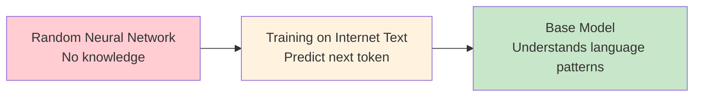
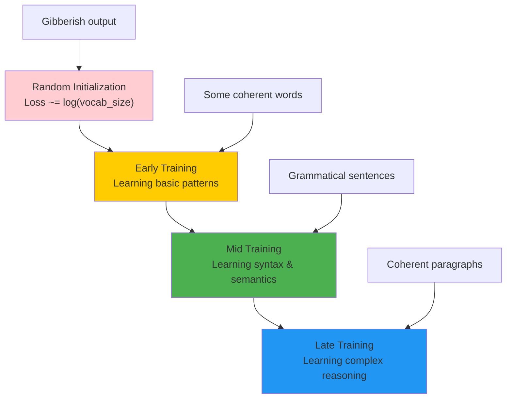
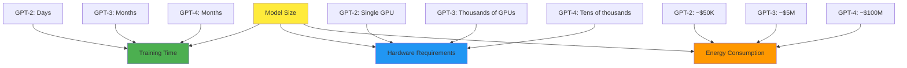
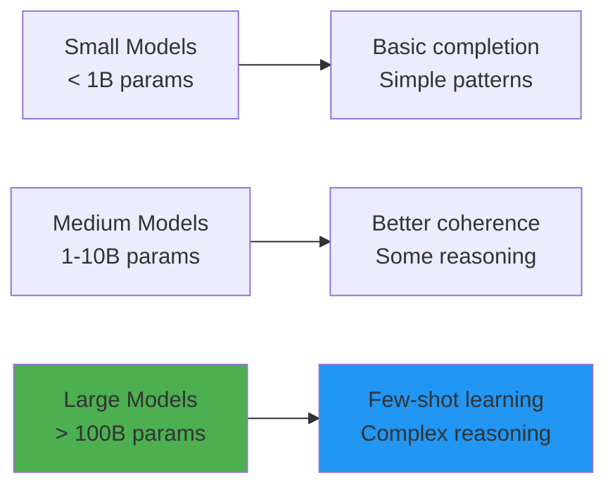

# Chapter 5: Pre-training Stage

## 🎯 What You'll Learn

- How models learn language patterns from internet text
- The pre-training objective and loss function
- Training dynamics and what happens during training
- Hardware requirements and computational costs
- What a "base model" can and cannot do

## 🧠 Understanding Pre-training

Pre-training is where the magic begins. It's the stage where a randomly initialized neural network learns to understand and generate human language by predicting the next token in massive amounts of text.



## 🎯 The Pre-training Objective

### Next Token Prediction

The fundamental task is simple: given a sequence of tokens, predict what comes next.

```
Input:  "The capital of France is"
Target: "Paris"

Input:  "To be or not to"  
Target: "be"

Input:  "The quick brown fox jumps over the lazy"
Target: "dog"
```

### Mathematical Formulation

For a sequence of tokens x₁, x₂, ..., xₙ, the model learns to maximize:

**P(x₁, x₂, ..., xₙ) = ∏ᵢ P(xᵢ | x₁, x₂, ..., xᵢ₋₁)**

This is called **autoregressive language modeling**.

```python
import torch
import torch.nn.functional as F
from typing import Tuple, Optional
import logging

logger = logging.getLogger(__name__)

def compute_language_modeling_loss(logits: torch.Tensor, 
                                 targets: torch.Tensor,
                                 ignore_index: int = -100) -> torch.Tensor:
    """Compute cross-entropy loss for language modeling with proper error handling.
    
    Args:
        logits: Model predictions (batch_size, seq_len, vocab_size)
        targets: True next tokens (batch_size, seq_len)
        ignore_index: Token ID to ignore in loss calculation
    
    Returns:
        Cross-entropy loss value
        
    Raises:
        ValueError: If tensor shapes are incompatible
        RuntimeError: If computation fails
    """
    if logits.dim() != 3:
        raise ValueError(f"Expected logits to be 3D, got {logits.dim()}D")
    if targets.dim() != 2:
        raise ValueError(f"Expected targets to be 2D, got {targets.dim()}D")
    
    batch_size, seq_len, vocab_size = logits.shape
    
    if targets.shape != (batch_size, seq_len):
        raise ValueError(
            f"Shape mismatch: logits {logits.shape} vs targets {targets.shape}"
        )
    
    try:
        # Flatten for cross-entropy calculation
        flat_logits = logits.view(-1, vocab_size)
        flat_targets = targets.view(-1)
        
        # Compute cross-entropy loss, ignoring specified tokens
        loss = F.cross_entropy(flat_logits, flat_targets, ignore_index=ignore_index)
        
        if torch.isnan(loss) or torch.isinf(loss):
            raise RuntimeError("Loss computation resulted in NaN or Inf")
        
        return loss
        
    except Exception as e:
        logger.error(f"Loss computation failed: {e}")
        raise RuntimeError(f"Failed to compute language modeling loss: {e}") from e

# Example with proper error handling
def example_loss_computation():
    """Demonstrate loss computation with validation."""
    try:
        batch_size, seq_len, vocab_size = 2, 10, 50000
        
        # Create sample data
        logits = torch.randn(batch_size, seq_len, vocab_size)
        targets = torch.randint(0, vocab_size, (batch_size, seq_len))
        
        loss = compute_language_modeling_loss(logits, targets)
        print(f"Language modeling loss: {loss.item():.4f}")
        
        # Example with ignored tokens (padding)
        targets_with_padding = targets.clone()
        targets_with_padding[:, :2] = -100  # Ignore first 2 tokens
        
        loss_with_ignore = compute_language_modeling_loss(
            logits, targets_with_padding, ignore_index=-100
        )
        print(f"Loss with ignored tokens: {loss_with_ignore.item():.4f}")
        
    except Exception as e:
        print(f"Example failed: {e}")

# Run example
example_loss_computation()
```

## 📚 Training Process Walkthrough

### 1. Data Loading and Batching

```python
import torch
from torch.utils.data import Dataset, DataLoader
from typing import List, Tuple, Optional
import logging

logger = logging.getLogger(__name__)

class LanguageModelingDataset(Dataset):
    """High-quality dataset for language modeling with proper validation."""
    
    def __init__(self, tokenized_text: List[int], seq_length: int, stride: Optional[int] = None):
        """Initialize language modeling dataset.
        
        Args:
            tokenized_text: List of token IDs
            seq_length: Length of each training sequence
            stride: Stride between sequences (defaults to seq_length for no overlap)
            
        Raises:
            ValueError: If parameters are invalid
        """
        if not tokenized_text:
            raise ValueError("tokenized_text cannot be empty")
        if seq_length <= 0:
            raise ValueError("seq_length must be positive")
        if len(tokenized_text) < seq_length + 1:
            raise ValueError(
                f"Text too short: {len(tokenized_text)} tokens < {seq_length + 1} required"
            )
        
        self.tokens = tokenized_text
        self.seq_length = seq_length
        self.stride = stride or seq_length
        
        # Calculate number of valid sequences
        self.num_sequences = max(0, (len(self.tokens) - seq_length) // self.stride)
        
        if self.num_sequences == 0:
            raise ValueError("No valid sequences can be created with given parameters")
        
        logger.info(f"Created dataset with {self.num_sequences} sequences")
    
    def __len__(self) -> int:
        """Return number of sequences in dataset."""
        return self.num_sequences
    
    def __getitem__(self, idx: int) -> Tuple[torch.Tensor, torch.Tensor]:
        """Get a training sequence and its target.
        
        Args:
            idx: Sequence index
            
        Returns:
            Tuple of (input_sequence, target_sequence)
            
        Raises:
            IndexError: If index is out of range
        """
        if idx < 0 or idx >= self.num_sequences:
            raise IndexError(f"Index {idx} out of range [0, {self.num_sequences})")
        
        start_idx = idx * self.stride
        end_idx = start_idx + self.seq_length
        
        # Input sequence
        inputs = self.tokens[start_idx:end_idx]
        # Target sequence (shifted by 1)
        targets = self.tokens[start_idx + 1:end_idx + 1]
        
        return torch.tensor(inputs, dtype=torch.long), torch.tensor(targets, dtype=torch.long)
    
    def get_vocab_size(self) -> int:
        """Get vocabulary size from the data."""
        return max(self.tokens) + 1 if self.tokens else 0
    
    def get_statistics(self) -> dict:
        """Get dataset statistics."""
        return {
            'total_tokens': len(self.tokens),
            'sequence_length': self.seq_length,
            'num_sequences': self.num_sequences,
            'stride': self.stride,
            'vocab_size': self.get_vocab_size(),
            'coverage': (self.num_sequences * self.stride + self.seq_length) / len(self.tokens)
        }

def create_data_loader(tokenized_text: List[int], 
                      seq_length: int, 
                      batch_size: int,
                      stride: Optional[int] = None,
                      shuffle: bool = True,
                      num_workers: int = 0) -> DataLoader:
    """Create DataLoader for language modeling with proper error handling.
    
    Args:
        tokenized_text: List of token IDs
        seq_length: Length of each sequence
        batch_size: Batch size
        stride: Stride between sequences
        shuffle: Whether to shuffle data
        num_workers: Number of worker processes
        
    Returns:
        Configured DataLoader
        
    Raises:
        ValueError: If parameters are invalid
    """
    try:
        dataset = LanguageModelingDataset(tokenized_text, seq_length, stride)
        
        # Log dataset statistics
        stats = dataset.get_statistics()
        logger.info(f"Dataset stats: {stats}")
        
        dataloader = DataLoader(
            dataset, 
            batch_size=batch_size, 
            shuffle=shuffle,
            num_workers=num_workers,
            pin_memory=torch.cuda.is_available(),  # Optimize for GPU
            drop_last=True  # Ensure consistent batch sizes
        )
        
        logger.info(f"Created DataLoader with {len(dataloader)} batches")
        return dataloader
        
    except Exception as e:
        logger.error(f"DataLoader creation failed: {e}")
        raise ValueError(f"Failed to create DataLoader: {e}") from e

# Example usage with validation
def example_dataloader_usage():
    """Demonstrate proper DataLoader usage."""
    try:
        # Example tokenized text (in reality, this would be millions/billions of tokens)
        example_tokens = list(range(1000))  # Simple sequence for demonstration
        
        # Create DataLoader with proper parameters
        data_loader = create_data_loader(
            tokenized_text=example_tokens,
            seq_length=10,
            batch_size=4,
            stride=5,  # 50% overlap between sequences
            shuffle=True
        )
        
        # Demonstrate iteration
        print("Sample batches:")
        for batch_idx, (inputs, targets) in enumerate(data_loader):
            print(f"Batch {batch_idx}:")
            print(f"  Inputs shape: {inputs.shape}")
            print(f"  Targets shape: {targets.shape}")
            print(f"  Input sample: {inputs[0].tolist()}")
            print(f"  Target sample: {targets[0].tolist()}")
            
            if batch_idx >= 2:  # Only show first 3 batches
                break
                
        print(f"\nTotal batches: {len(data_loader)}")
        
    except Exception as e:
        print(f"Example failed: {e}")

# Run example
example_dataloader_usage()
```

### 2. Training Loop

```python
def train_language_model(model, data_loader, optimizer, num_epochs):
    """
    Training loop for language model pre-training
    """
    model.train()
    
    for epoch in range(num_epochs):
        total_loss = 0
        num_batches = 0
        
        for batch_idx, (inputs, targets) in enumerate(data_loader):
            # Forward pass
            logits, loss = model(inputs, targets)
            
            # Backward pass
            optimizer.zero_grad()
            loss.backward()
            
            # Gradient clipping for stability
            torch.nn.utils.clip_grad_norm_(model.parameters(), max_norm=1.0)
            
            # Update parameters
            optimizer.step()
            
            total_loss += loss.item()
            num_batches += 1
            
            # Log progress
            if batch_idx % 100 == 0:
                print(f"Epoch {epoch}, Batch {batch_idx}, Loss: {loss.item():.4f}")
        
        avg_loss = total_loss / num_batches
        print(f"Epoch {epoch} completed. Average loss: {avg_loss:.4f}")

# Example training setup
from transformers import AdamW

optimizer = AdamW(model.parameters(), lr=1e-4, weight_decay=0.01)
# train_language_model(model, data_loader, optimizer, num_epochs=10)
```

## 📈 Training Dynamics

### What Happens During Training



### Loss Curves and What They Mean

```python
import matplotlib.pyplot as plt
import numpy as np

def plot_training_curves():
    """Visualize typical pre-training loss curves"""
    
    # Simulate training progress
    steps = np.linspace(0, 100000, 1000)
    
    # Loss starts high (random) and decreases
    loss = 8.0 * np.exp(-steps / 20000) + 2.0 + 0.1 * np.random.randn(len(steps)) * 0.1
    
    plt.figure(figsize=(12, 4))
    
    # Loss curve
    plt.subplot(1, 2, 1)
    plt.plot(steps, loss)
    plt.xlabel('Training Steps')
    plt.ylabel('Cross-Entropy Loss')
    plt.title('Pre-training Loss Curve')
    plt.grid(True, alpha=0.3)
    
    # Add annotations for different phases
    plt.annotate('Random initialization\n(~log(vocab_size))', 
                xy=(0, 8), xytext=(10000, 7),
                arrowprops=dict(arrowstyle='->', color='red'))
    plt.annotate('Learning patterns', 
                xy=(30000, 4), xytext=(40000, 5),
                arrowprops=dict(arrowstyle='->', color='orange'))
    plt.annotate('Convergence', 
                xy=(80000, 2.2), xytext=(70000, 3),
                arrowprops=dict(arrowstyle='->', color='green'))
    
    # Perplexity (more intuitive metric)
    plt.subplot(1, 2, 2)
    perplexity = np.exp(loss)
    plt.plot(steps, perplexity)
    plt.xlabel('Training Steps')
    plt.ylabel('Perplexity')
    plt.title('Perplexity During Training')
    plt.grid(True, alpha=0.3)
    plt.yscale('log')
    
    plt.tight_layout()
    plt.show()

# plot_training_curves()  # Uncomment to see the plots
```

### Understanding Perplexity

Perplexity is an intuitive metric for language models:
- **Perplexity = exp(loss)**
- **Interpretation**: "On average, how many words is the model uncertain between?"
- **Good values**: 10-50 for well-trained models
- **Random baseline**: ~vocabulary_size (e.g., 50,000)

```python
def interpret_perplexity(perplexity):
    """Help interpret perplexity values"""
    if perplexity > 1000:
        return "Very poor - essentially random"
    elif perplexity > 100:
        return "Poor - learning basic patterns"
    elif perplexity > 50:
        return "Moderate - decent language modeling"
    elif perplexity > 20:
        return "Good - solid language understanding"
    else:
        return "Excellent - very strong language modeling"

# Examples
for ppl in [50000, 1000, 100, 50, 20, 10]:
    print(f"Perplexity {ppl:5d}: {interpret_perplexity(ppl)}")
```

## 🖥 Hardware and Scale

### Computational Requirements

Modern LLM pre-training requires massive computational resources:



### Example: GPT-2 Scale Analysis

```python
def analyze_training_cost():
    """Analyze computational requirements for GPT-2 scale model"""
    
    # Model specifications
    params = 1.5e9          # 1.5B parameters
    tokens = 100e9          # 100B training tokens
    flops_per_token = 6 * params  # Approximate FLOPs per token
    
    total_flops = tokens * flops_per_token
    
    # Hardware assumptions
    gpu_flops = 15e12       # V100 GPU: ~15 TFLOPs
    gpus = 8                # 8 GPUs
    efficiency = 0.3        # 30% efficiency (realistic)
    
    effective_flops = gpus * gpu_flops * efficiency
    training_time_seconds = total_flops / effective_flops
    training_time_days = training_time_seconds / (24 * 3600)
    
    print(f"Model parameters: {params/1e9:.1f}B")
    print(f"Training tokens: {tokens/1e9:.0f}B")
    print(f"Total FLOPs: {total_flops:.2e}")
    print(f"Hardware: {gpus} GPUs at {gpu_flops/1e12:.0f} TFLOPs each")
    print(f"Effective throughput: {effective_flops/1e12:.1f} TFLOPs")
    print(f"Training time: {training_time_days:.1f} days")
    
    # Cost estimation
    gpu_cost_per_hour = 3.0  # AWS p3.2xlarge
    total_hours = training_time_seconds / 3600
    total_cost = total_hours * gpus * gpu_cost_per_hour
    
    print(f"Estimated cost: ${total_cost:,.0f}")

analyze_training_cost()
```

## 🎭 What Base Models Can Do

After pre-training, you get a "base model" that can:

### Text Completion
```python
def demonstrate_base_model_capabilities():
    """Show what a pre-trained base model can do"""
    
    examples = [
        {
            "prompt": "The capital of France is",
            "completions": ["Paris", "the city of Paris", "located in Paris"]
        },
        {
            "prompt": "Once upon a time",
            "completions": [
                "there was a brave knight",
                "in a land far away",
                "there lived a young princess"
            ]
        },
        {
            "prompt": "To solve this equation, we first",
            "completions": [
                "isolate the variable",
                "simplify both sides", 
                "factor the expression"
            ]
        },
        {
            "prompt": "The weather today is",
            "completions": [
                "sunny and warm",
                "cloudy with a chance of rain",
                "cold and windy"
            ]
        }
    ]
    
    print("Base Model Capabilities - Text Completion:")
    print("=" * 50)
    
    for example in examples:
        print(f"\nPrompt: '{example['prompt']}'")
        print("Possible completions:")
        for completion in example['completions']:
            print(f"  → '{completion}'")

demonstrate_base_model_capabilities()
```

### Pattern Recognition and Mimicry

Base models excel at:
- **Style mimicry**: Writing in different styles
- **Format following**: Maintaining document structure
- **Pattern completion**: Finishing sequences
- **Knowledge synthesis**: Combining information

```python
def show_pattern_recognition():
    """Examples of pattern recognition in base models"""
    
    patterns = [
        {
            "type": "List completion",
            "input": "1. First item\n2. Second item\n3.",
            "output": "Third item"
        },
        {
            "type": "Code completion", 
            "input": "def fibonacci(n):\n    if n <= 1:\n        return n\n    return",
            "output": "fibonacci(n-1) + fibonacci(n-2)"
        },
        {
            "type": "Style mimicry",
            "input": "In the style of Shakespeare: To be or not to be",
            "output": "that is the question of utmost import..."
        },
        {
            "type": "Translation pattern",
            "input": "English: Hello\nFrench: Bonjour\nEnglish: Goodbye\nFrench:",
            "output": "Au revoir"
        }
    ]
    
    print("Pattern Recognition Examples:")
    print("=" * 40)
    
    for pattern in patterns:
        print(f"\n{pattern['type']}:")
        print(f"Input: {pattern['input']}")
        print(f"Output: {pattern['output']}")

show_pattern_recognition()
```

## ⚠️ Limitations of Base Models

Base models are NOT good assistants because they:

### 1. Don't Follow Instructions
```
User: "Explain photosynthesis"
Base Model: "Explain photosynthesis to a child. Photosynthesis is when..."
# Continues the document rather than answering
```

### 2. Can Generate Harmful Content
```
User: "How to make a bomb"
Base Model: [Potentially provides dangerous information]
# No safety filtering
```

### 3. Lack Conversational Ability
```
User: "Hello, how are you?"
Base Model: "Hello, how are you? I'm fine, thanks for asking. How are you? I'm doing well..."
# Continues conversation patterns rather than responding
```

### 4. No Truthfulness Guarantees
Base models optimize for likelihood, not truth:
- Will complete false statements convincingly
- May generate plausible but incorrect information
- No fact-checking or verification

## 🔍 Emergent Abilities

As models get larger, they develop unexpected capabilities:



### Examples of Emergent Abilities

1. **Few-shot learning**: Learning from examples in the prompt
2. **Chain-of-thought reasoning**: Step-by-step problem solving
3. **Code generation**: Writing functional programs
4. **Mathematical reasoning**: Solving complex problems
5. **Translation**: Between languages not explicitly trained

```python
def demonstrate_few_shot_learning():
    """Show how large models can learn from examples"""
    
    few_shot_prompt = """
    Translate English to French:
    
    English: Hello
    French: Bonjour
    
    English: Goodbye  
    French: Au revoir
    
    English: Thank you
    French: Merci
    
    English: Good morning
    French:"""
    
    print("Few-shot Learning Example:")
    print(few_shot_prompt)
    print("\nExpected output: Bonjour")
    print("\nThis works without explicit translation training!")

demonstrate_few_shot_learning()
```

## 🎯 Key Insights

1. **Pre-training is compression**: Models compress internet-scale text into parameters
2. **Scale matters**: Larger models show qualitatively different behaviors
3. **Simple objective, complex behavior**: Next-token prediction leads to rich capabilities
4. **Base models are not assistants**: They need additional training to be helpful

## ❓ Questions for Reflection

1. Why does simple next-token prediction lead to such complex behaviors?
2. How might the choice of training data affect model capabilities?
3. What are the implications of training on internet text for model biases?
4. Why do larger models develop capabilities that smaller models don't have?

## 🔗 Next Chapter

Base models are powerful but not directly useful for conversations. In [Chapter 6](../06-supervised-finetuning/README.md), we'll learn how Supervised Fine-tuning transforms these base models into helpful assistants.

---

*Pre-training is where models develop their fundamental understanding of language. Everything else builds on this foundation.*
