# Chapter 6: Supervised Fine-tuning (SFT)

## 🎯 What You'll Learn

- How to transform a base model into an assistant
- The supervised fine-tuning process and data requirements
- Quality vs quantity in training data
- Instruction formatting and prompt engineering
- Evaluation methods for fine-tuned models

## 🎓 From Base Model to Assistant

Base models can complete text but aren't great at following instructions. Supervised fine-tuning teaches them to be helpful assistants.


## 📋 Instruction Dataset Format

### Standard Format Structure

```python
from dataclasses import dataclass
from typing import List, Optional

@dataclass
class InstructionExample:
    """Standard format for instruction-following examples"""
    instruction: str
    input: Optional[str] = None
    output: str = ""
    
    def format_for_training(self) -> str:
        """Format example for training"""
        if self.input:
            prompt = f"### Instruction:\n{self.instruction}\n\n### Input:\n{self.input}\n\n### Response:\n"
        else:
            prompt = f"### Instruction:\n{self.instruction}\n\n### Response:\n"
        
        return prompt + self.output

# Example dataset
examples = [
    InstructionExample(
        instruction="Write a haiku about programming",
        output="Code flows like water\nDebugging through the long night\nSoftware born at dawn"
    ),
    InstructionExample(
        instruction="Explain the concept in simple terms",
        input="Machine learning",
        output="Machine learning is like teaching a computer to recognize patterns by showing it lots of examples, similar to how a child learns to identify animals by looking at many pictures."
    ),
    InstructionExample(
        instruction="Translate the following text to French",
        input="Hello, how are you?",
        output="Bonjour, comment allez-vous ?"
    )
]

for example in examples:
    print(example.format_for_training())
    print("="*50)
```

### Chat Format (More Modern)

```python
@dataclass
class ChatMessage:
    """Chat message with role and content"""
    role: str  # "system", "user", "assistant"
    content: str

class ChatDataset:
    """Dataset for chat-based fine-tuning"""
    
    @staticmethod
    def format_conversation(messages: List[ChatMessage]) -> str:
        """Format conversation for training"""
        formatted = ""
        for msg in messages:
            if msg.role == "system":
                formatted += f"<|system|>\n{msg.content}\n"
            elif msg.role == "user":
                formatted += f"<|user|>\n{msg.content}\n"
            elif msg.role == "assistant":
                formatted += f"<|assistant|>\n{msg.content}\n"
        
        return formatted + "<|end|>"

# Example chat data
chat_example = [
    ChatMessage("system", "You are a helpful AI assistant that provides clear and accurate information."),
    ChatMessage("user", "What's the capital of France?"),
    ChatMessage("assistant", "The capital of France is Paris. It's located in the north-central part of the country and is also the largest city in France.")
]

print(ChatDataset.format_conversation(chat_example))
```

## 🔧 Training Process

### 1. Data Preparation Pipeline

```python
import json
import torch
from torch.utils.data import Dataset, DataLoader
from transformers import AutoTokenizer

class SupervisedFineTuningDataset(Dataset):
    """Dataset for supervised fine-tuning"""
    
    def __init__(self, examples: List[InstructionExample], tokenizer, max_length: int = 512):
        self.examples = examples
        self.tokenizer = tokenizer
        self.max_length = max_length
    
    def __len__(self) -> int:
        return len(self.examples)
    
    def __getitem__(self, idx: int) -> dict:
        example = self.examples[idx]
        
        # Format the full training example
        full_text = example.format_for_training()
        
        # Tokenize
        encoding = self.tokenizer(
            full_text,
            truncation=True,
            padding="max_length",
            max_length=self.max_length,
            return_tensors="pt"
        )
        
        # Create labels (same as input_ids, but with -100 for prompt tokens)
        input_ids = encoding["input_ids"].squeeze()
        labels = input_ids.clone()
        
        # Find where the response starts (mask prompt tokens)
        response_start = full_text.find("### Response:\n") + len("### Response:\n")
        response_start_token = len(self.tokenizer.encode(full_text[:response_start]))
        
        # Mask prompt tokens with -100 (ignored in loss calculation)
        labels[:response_start_token] = -100
        
        return {
            "input_ids": input_ids,
            "attention_mask": encoding["attention_mask"].squeeze(),
            "labels": labels
        }

def create_sft_dataloader(examples: List[InstructionExample], 
                         tokenizer, 
                         batch_size: int = 4,
                         max_length: int = 512) -> DataLoader:
    """Create DataLoader for SFT training"""
    dataset = SupervisedFineTuningDataset(examples, tokenizer, max_length)
    return DataLoader(dataset, batch_size=batch_size, shuffle=True)
```

### 2. Training Loop with Quality Monitoring

```python
import torch.nn.functional as F
from torch.optim import AdamW
from transformers import get_linear_schedule_with_warmup

class SFTTrainer:
    """Supervised Fine-tuning Trainer"""
    
    def __init__(self, model, tokenizer, learning_rate: float = 5e-5):
        self.model = model
        self.tokenizer = tokenizer
        self.optimizer = AdamW(model.parameters(), lr=learning_rate)
        
    def train_epoch(self, dataloader: DataLoader, epoch: int) -> float:
        """Train for one epoch"""
        self.model.train()
        total_loss = 0.0
        num_batches = 0
        
        for batch_idx, batch in enumerate(dataloader):
            # Move to device
            input_ids = batch["input_ids"]
            attention_mask = batch["attention_mask"]
            labels = batch["labels"]
            
            # Forward pass
            outputs = self.model(
                input_ids=input_ids,
                attention_mask=attention_mask,
                labels=labels
            )
            
            loss = outputs.loss
            
            # Backward pass
            self.optimizer.zero_grad()
            loss.backward()
            
            # Gradient clipping
            torch.nn.utils.clip_grad_norm_(self.model.parameters(), max_norm=1.0)
            
            self.optimizer.step()
            
            total_loss += loss.item()
            num_batches += 1
            
            if batch_idx % 10 == 0:
                print(f"Epoch {epoch}, Batch {batch_idx}, Loss: {loss.item():.4f}")
        
        return total_loss / num_batches
    
    def evaluate_quality(self, test_examples: List[InstructionExample]) -> dict:
        """Evaluate model quality on test examples"""
        self.model.eval()
        results = {}
        
        with torch.no_grad():
            for i, example in enumerate(test_examples[:5]):  # Sample evaluation
                prompt = example.format_for_training().split("### Response:\n")[0] + "### Response:\n"
                
                # Generate response
                inputs = self.tokenizer.encode(prompt, return_tensors="pt")
                outputs = self.model.generate(
                    inputs,
                    max_new_tokens=100,
                    temperature=0.7,
                    do_sample=True,
                    pad_token_id=self.tokenizer.eos_token_id
                )
                
                generated = self.tokenizer.decode(outputs[0][inputs.shape[1]:], skip_special_tokens=True)
                
                results[f"example_{i}"] = {
                    "instruction": example.instruction,
                    "expected": example.output,
                    "generated": generated.strip()
                }
        
        return results
```

## 📊 Data Quality vs Quantity

```mermaid
graph TD
    A[SFT Data Strategy] --> B[High Quality<br/>1K-10K examples]
    A --> C[Medium Quality<br/>50K-100K examples]
    A --> D[Low Quality<br/>1M+ examples]
    
    B --> E[✅ Better instruction following<br/>✅ Higher consistency<br/>✅ Faster training]
    C --> F[⚖️ Balanced performance<br/>⚖️ Requires filtering<br/>⚖️ Moderate training time]
    D --> G[❌ Inconsistent quality<br/>❌ Longer training<br/>❌ May learn bad patterns]
    
    style B fill:#c8e6c9
    style E fill:#c8e6c9
```



### Quality Assessment Tools

```python
class DataQualityAnalyzer:
    """Analyze quality of instruction-following dataset"""
    
    def __init__(self, examples: List[InstructionExample]):
        self.examples = examples
    
    def analyze_length_distribution(self) -> dict:
        """Analyze length patterns in the dataset"""
        instruction_lengths = [len(ex.instruction.split()) for ex in self.examples]
        output_lengths = [len(ex.output.split()) for ex in self.examples]
        
        return {
            "avg_instruction_length": sum(instruction_lengths) / len(instruction_lengths),
            "avg_output_length": sum(output_lengths) / len(output_lengths),
            "max_instruction_length": max(instruction_lengths),
            "max_output_length": max(output_lengths)
        }
    
    def detect_repetitive_patterns(self) -> dict:
        """Detect repetitive or low-quality examples"""
        instruction_starts = [ex.instruction[:20] for ex in self.examples]
        output_starts = [ex.output[:20] for ex in self.examples]
        
        from collections import Counter
        instruction_patterns = Counter(instruction_starts)
        output_patterns = Counter(output_starts)
        
        return {
            "repetitive_instructions": [pattern for pattern, count in instruction_patterns.items() if count > 5],
            "repetitive_outputs": [pattern for pattern, count in output_patterns.items() if count > 5]
        }
    
    def diversity_score(self) -> float:
        """Calculate dataset diversity score"""
        unique_instructions = len(set(ex.instruction for ex in self.examples))
        total_instructions = len(self.examples)
        return unique_instructions / total_instructions

# Example usage
analyzer = DataQualityAnalyzer(examples)
quality_report = {
    "length_stats": analyzer.analyze_length_distribution(),
    "repetitive_patterns": analyzer.detect_repetitive_patterns(),
    "diversity": analyzer.diversity_score()
}

print("Dataset Quality Report:")
for metric, value in quality_report.items():
    print(f"{metric}: {value}")
```

## 🎯 Evaluation Metrics

### 1. Automatic Metrics

```python
class SFTEvaluator:
    """Comprehensive evaluation for SFT models"""
    
    def __init__(self, model, tokenizer):
        self.model = model
        self.tokenizer = tokenizer
    
    def evaluate_instruction_following(self, test_examples: List[InstructionExample]) -> dict:
        """Evaluate how well model follows instructions"""
        results = {
            "response_lengths": [],
            "completion_rates": [],
            "format_adherence": []
        }
        
        for example in test_examples:
            prompt = self._format_prompt(example.instruction, example.input)
            response = self._generate_response(prompt)
            
            # Check response length appropriateness
            expected_length = len(example.output.split())
            actual_length = len(response.split())
            length_ratio = actual_length / max(expected_length, 1)
            results["response_lengths"].append(length_ratio)
            
            # Check if response completes the task
            completion_score = self._assess_completion(example, response)
            results["completion_rates"].append(completion_score)
            
            # Check format adherence
            format_score = self._assess_format(example, response)
            results["format_adherence"].append(format_score)
        
        return {
            "avg_length_ratio": sum(results["response_lengths"]) / len(results["response_lengths"]),
            "completion_rate": sum(results["completion_rates"]) / len(results["completion_rates"]),
            "format_adherence": sum(results["format_adherence"]) / len(results["format_adherence"])
        }
    
    def _format_prompt(self, instruction: str, input_text: str = None) -> str:
        """Format prompt for evaluation"""
        if input_text:
            return f"### Instruction:\n{instruction}\n\n### Input:\n{input_text}\n\n### Response:\n"
        return f"### Instruction:\n{instruction}\n\n### Response:\n"
    
    def _generate_response(self, prompt: str) -> str:
        """Generate response for evaluation"""
        inputs = self.tokenizer.encode(prompt, return_tensors="pt")
        with torch.no_grad():
            outputs = self.model.generate(
                inputs,
                max_new_tokens=150,
                temperature=0.7,
                do_sample=True,
                pad_token_id=self.tokenizer.eos_token_id
            )
        
        response = self.tokenizer.decode(outputs[0][inputs.shape[1]:], skip_special_tokens=True)
        return response.strip()
    
    def _assess_completion(self, example: InstructionExample, response: str) -> float:
        """Assess if the response completes the task (simplified)"""
        # This is a simplified version - in practice, you'd use more sophisticated methods
        task_keywords = example.instruction.lower().split()
        response_lower = response.lower()
        
        keyword_coverage = sum(1 for keyword in task_keywords if keyword in response_lower)
        return keyword_coverage / len(task_keywords)
    
    def _assess_format(self, example: InstructionExample, response: str) -> float:
        """Assess if response follows expected format"""
        # Check for common format issues
        if len(response.strip()) == 0:
            return 0.0
        
        if response.startswith("### "):  # Model repeating format
            return 0.5
        
        return 1.0
```

## 🚀 Advanced Techniques

### Parameter-Efficient Fine-tuning (LoRA)

```python
from peft import LoraConfig, get_peft_model, TaskType

class LoRASFTTrainer:
    """LoRA-based SFT for efficient training"""
    
    def __init__(self, base_model, tokenizer, lora_rank: int = 16):
        # Configure LoRA
        lora_config = LoraConfig(
            task_type=TaskType.CAUSAL_LM,
            inference_mode=False,
            r=lora_rank,
            lora_alpha=32,
            lora_dropout=0.1,
            target_modules=["q_proj", "v_proj", "k_proj", "o_proj"]
        )
        
        # Apply LoRA to model
        self.model = get_peft_model(base_model, lora_config)
        self.tokenizer = tokenizer
        
        # Only train LoRA parameters
        self.model.print_trainable_parameters()
    
    def get_trainable_params(self) -> int:
        """Get number of trainable parameters"""
        trainable_params = 0
        all_params = 0
        
        for _, param in self.model.named_parameters():
            all_params += param.numel()
            if param.requires_grad:
                trainable_params += param.numel()
        
        return trainable_params, all_params
```

## 🔍 Common Issues and Solutions

### Issue 1: Overfitting to Training Format

```python
def detect_format_overfitting(model, tokenizer, test_prompts: List[str]) -> dict:
    """Detect if model is overfitting to training format"""
    results = {"overfitting_indicators": []}
    
    for prompt in test_prompts:
        # Test with training format
        formatted_prompt = f"### Instruction:\n{prompt}\n\n### Response:\n"
        response1 = generate_response(model, tokenizer, formatted_prompt)
        
        # Test without training format
        response2 = generate_response(model, tokenizer, prompt)
        
        # Check if responses are dramatically different
        if len(response1) > 2 * len(response2) or "###" in response2:
            results["overfitting_indicators"].append({
                "prompt": prompt,
                "formatted_response_length": len(response1),
                "unformatted_response_length": len(response2),
                "format_leaked": "###" in response2
            })
    
    return results

def generate_response(model, tokenizer, prompt: str) -> str:
    """Helper function to generate response"""
    inputs = tokenizer.encode(prompt, return_tensors="pt")
    with torch.no_grad():
        outputs = model.generate(inputs, max_new_tokens=100, do_sample=True)
    return tokenizer.decode(outputs[0][inputs.shape[1]:], skip_special_tokens=True)
```

## 🎯 Best Practices Summary

### Data Preparation
1. **Quality over Quantity**: 1K high-quality examples > 100K low-quality ones
2. **Diverse Instructions**: Cover various task types and complexity levels
3. **Consistent Formatting**: Use standardized prompt formats
4. **Response Quality**: Ensure responses are helpful, accurate, and well-formatted

### Training Process
1. **Lower Learning Rate**: 1e-5 to 5e-5 (much lower than pre-training)
2. **Short Training**: 1-3 epochs to avoid overfitting
3. **Regular Evaluation**: Monitor instruction-following capability
4. **Gradient Clipping**: Prevent gradient explosion

### Quality Control
1. **Human Evaluation**: Regular human assessment of outputs
2. **Format Validation**: Ensure model doesn't overfit to prompt format
3. **Capability Testing**: Test on held-out instruction types
4. **Safety Checking**: Ensure model remains safe and aligned


## 🔗 Next Steps

After SFT, you have a helpful assistant, but it may not be perfectly aligned with human preferences. The next step is typically **Reinforcement Learning from Human Feedback (RLHF)** to further align the model with human values and preferences.

**Key Takeaway**: SFT transforms a base model into an instruction-following assistant, but the quality of your training data directly determines the quality of your assistant.
