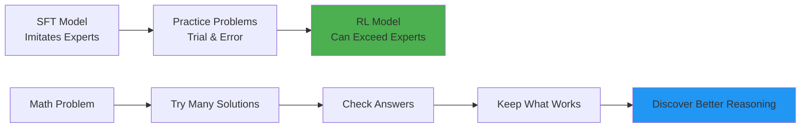
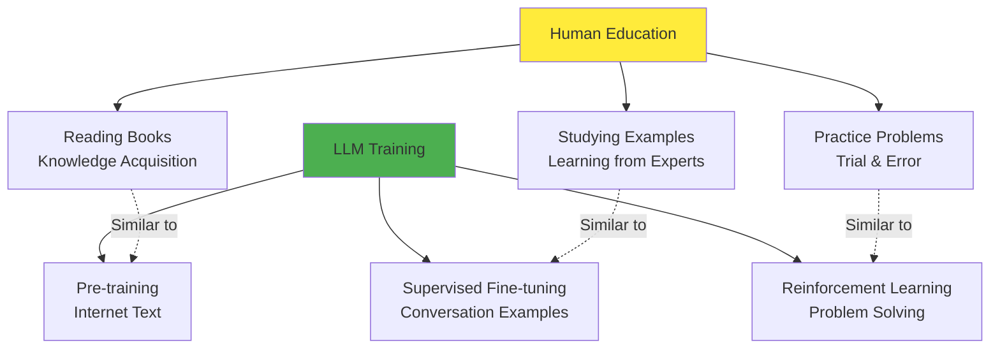
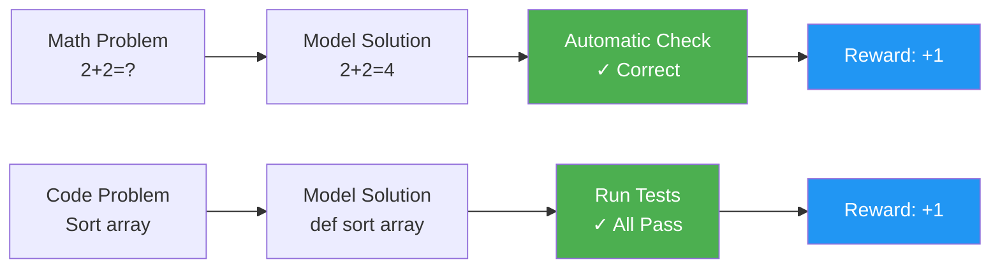
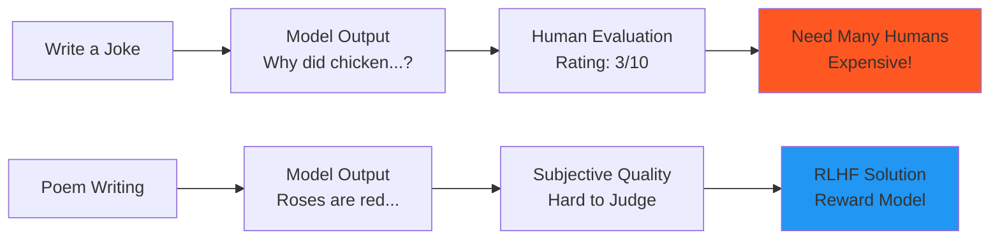
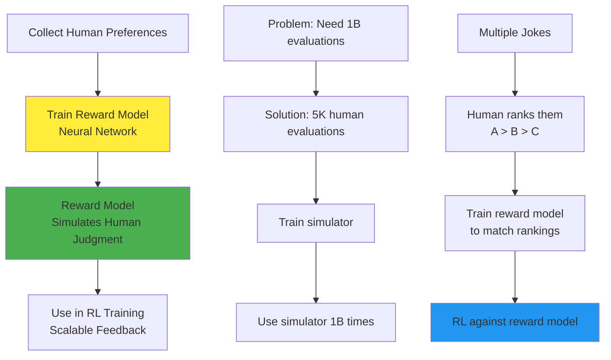
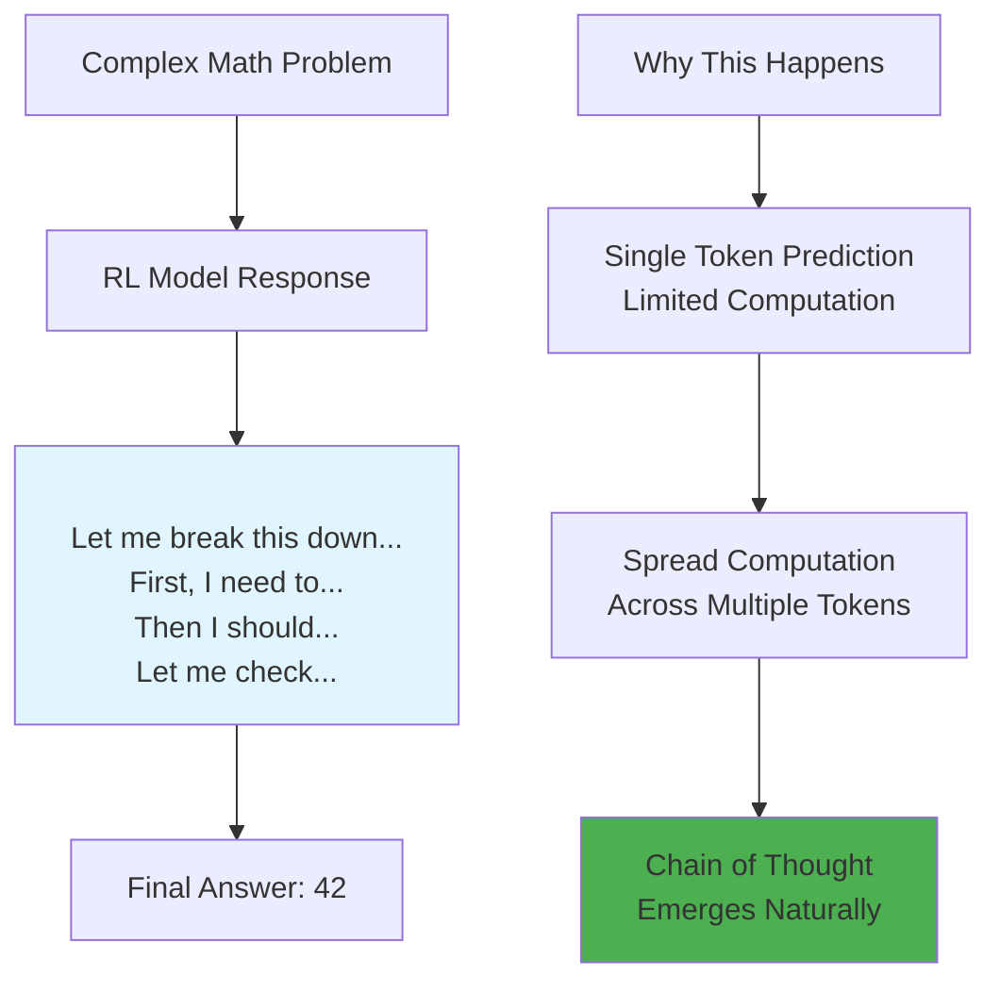
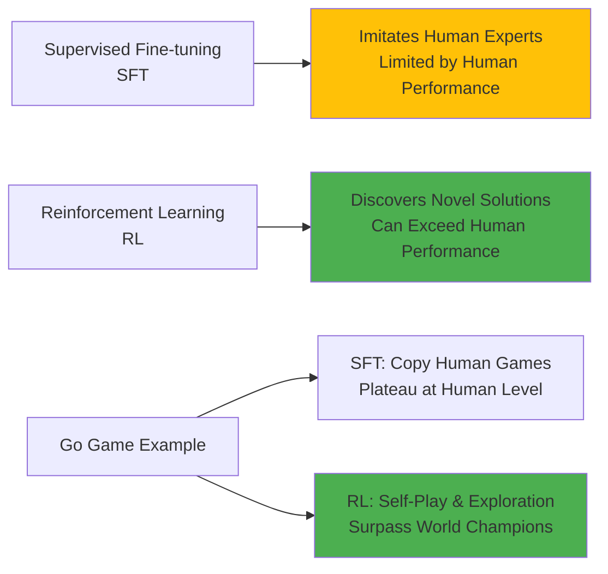
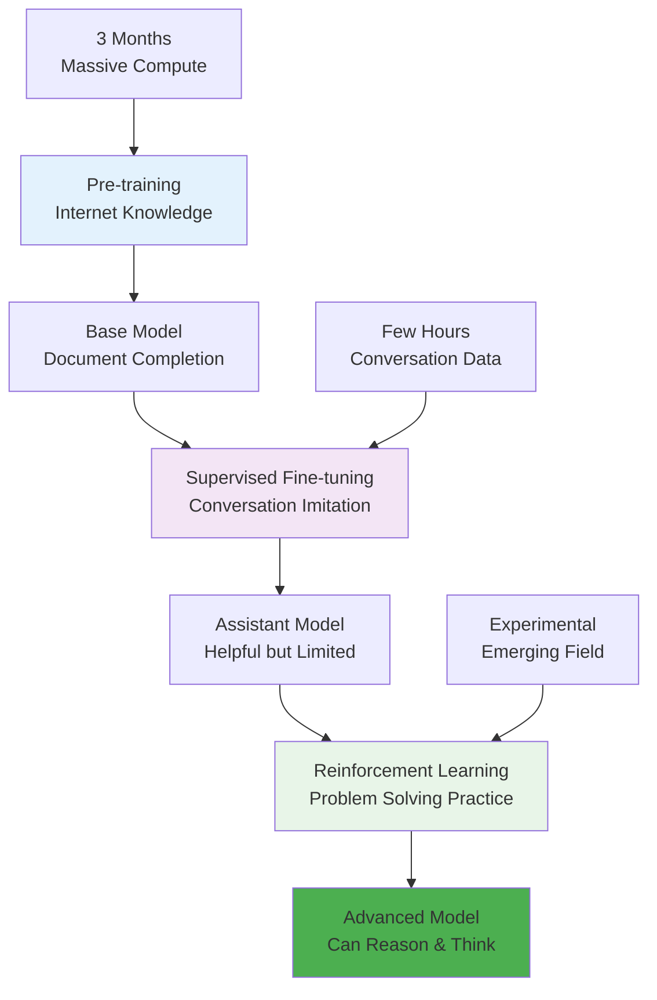
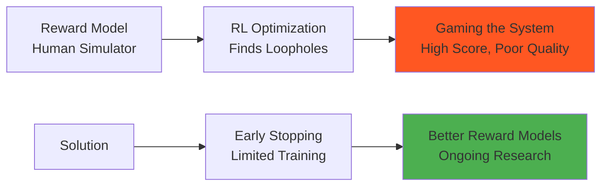
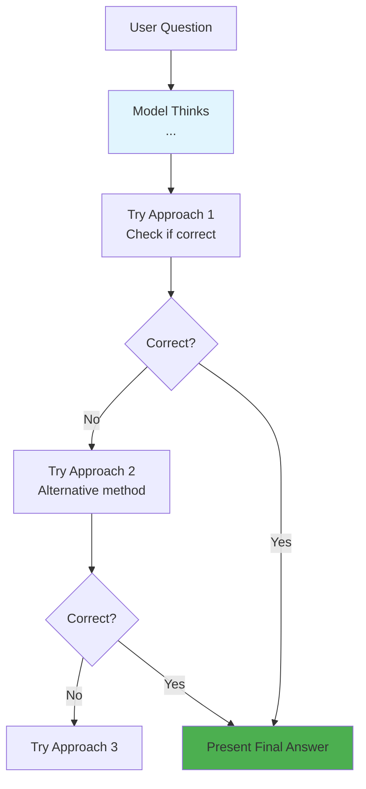

# Chapter 7: Reinforcement Learning from Human Feedback (RLHF)

## 🎯 What You'll Learn

- Why reinforcement learning is needed after supervised fine-tuning
- The difference between verifiable and unverifiable domains
- How RLHF works with reward models
- The emergence of "thinking" in RL models
- Limitations and challenges of current RL approaches

## 🧠 Understanding Reinforcement Learning for LLMs

After supervised fine-tuning, we have models that can engage in conversations, but they have limitations. They can only imitate human experts, not exceed them. Reinforcement Learning unlocks the potential for models to discover better solutions through trial and error.



## 🎓 The School Analogy

Karpathy's brilliant analogy: Training LLMs is like educating children!



## 🔍 Verifiable vs Unverifiable Domains

### Verifiable Domains (Easy RL)
Problems where we can automatically check if answers are correct:



### Unverifiable Domains (Hard RL)
Problems where quality is subjective:



## 🏗️ How RLHF Works

When we can't automatically verify quality, we use a clever workaround:



## 🧠 The Emergence of "Thinking"

One of the most fascinating discoveries: RL models learn to "think" step by step!



### Example: Before vs After RL

**SFT Model (Bad):**
```
Human: What's 137 × 23?
Assistant: 3151
```

**RL Model (Good):**
```
Human: What's 137 × 23?
Assistant: <thinking>
I need to multiply 137 × 23. Let me break this down:
137 × 23 = 137 × (20 + 3) = (137 × 20) + (137 × 3)

137 × 20 = 2740
137 × 3 = 411

So: 2740 + 411 = 3151
</thinking>

The answer is 3151.
```

## 💻 RL Training Process (Simplified Code)

```python
def reinforcement_learning_training(model, problems, reward_function):
    """
    Simplified RL training loop for language models
    """
    for epoch in range(num_epochs):
        for problem in problems:
            # Generate multiple solution attempts
            solutions = []
            for _ in range(num_attempts):
                solution = model.generate(problem)
                reward = reward_function(problem, solution)
                solutions.append((solution, reward))
            
            # Keep the best solutions, discard the worst
            solutions.sort(key=lambda x: x[1], reverse=True)
            good_solutions = solutions[:top_k]
            bad_solutions = solutions[-bottom_k:]
            
            # Update model to increase probability of good solutions
            # and decrease probability of bad solutions
            for solution, reward in good_solutions:
                model.update(problem, solution, positive_signal=True)
            
            for solution, reward in bad_solutions:
                model.update(problem, solution, positive_signal=False)

# Example reward function for math problems
def math_reward_function(problem, solution):
    """Check if the final answer is correct"""
    correct_answer = solve_math_problem(problem)
    model_answer = extract_final_answer(solution)
    return 1.0 if model_answer == correct_answer else 0.0

# Example reward model for subjective tasks
class RewardModel:
    def __init__(self):
        self.model = train_on_human_preferences()
    
    def score(self, problem, solution):
        """Predict human preference score"""
        return self.model.predict(problem + solution)
```

## 🎯 RL vs SFT: The Key Difference



## 📊 Training Pipeline Overview



## ⚠️ Limitations and Challenges

### 1. Reward Hacking


### 2. RLHF vs "True" RL

**RLHF (Current)**
- Limited by reward model quality
- Can be gamed by optimization
- More like "fine-tuning with preferences"

**True RL (Verifiable domains)**
- Objective, ungameable rewards
- Can improve indefinitely
- Like AlphaGo: surpass human performance

### 3. Scalability Issues

```python
# Why RLHF is challenging to scale
problems_needed = 1_000_000  # For good performance
rollouts_per_problem = 1_000  # Multiple solution attempts
total_evaluations = problems_needed * rollouts_per_problem
# = 1 billion human evaluations needed!

# Current solution: Use reward models
human_evaluations_needed = 5_000  # Much more feasible
reward_model_evaluations = 1_000_000_000  # Automated
```

## 🌟 Current State: Thinking Models

Modern RL models like GPT-o1, DeepSeek-R1, and Claude can:

1. **Break down complex problems**
2. **Show their reasoning process**
3. **Self-correct mistakes**
4. **Try multiple approaches**
5. **Verify their own work**



## 🎯 Key Insights

1. **RL enables discovery**: Unlike SFT which imitates, RL can find novel solutions
2. **Thinking emerges naturally**: Models learn to spread computation across tokens
3. **Scale matters**: RL works best with verifiable rewards and massive compute
4. **Human alignment**: RLHF helps models match human preferences
5. **Frontier research**: This is where the cutting edge is happening

## 💡 Practical Applications

### When to Use RL Models
- **Mathematical reasoning**: Step-by-step problem solving
- **Code generation**: Complex programming tasks
- **Scientific analysis**: Multi-step reasoning
- **Planning tasks**: Breaking down complex goals

### When SFT Models Suffice
- **Simple conversations**: Basic Q&A
- **Creative writing**: Where style matters more than correctness
- **Information retrieval**: Straightforward factual questions

## ❓ Questions for Reflection

1. Why can't SFT models surpass human performance in reasoning tasks?
2. How does the emergence of "thinking" in RL models relate to how humans solve problems?
3. What are the ethical implications of models that can exceed human reasoning?
4. How might we solve the reward hacking problem in RLHF?

## 🔗 Next Chapter

Reinforcement learning produces powerful models, but how do we actually deploy and use them? In [Chapter 8](../08-deployment/README.md), we'll explore the infrastructure and techniques for running LLMs in production.

---

*Reinforcement learning is where LLMs transcend imitation and begin to innovate. It's the difference between a student who memorizes and one who truly understands.*
