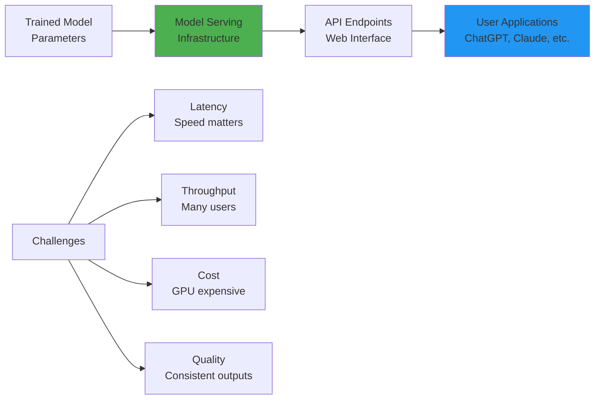
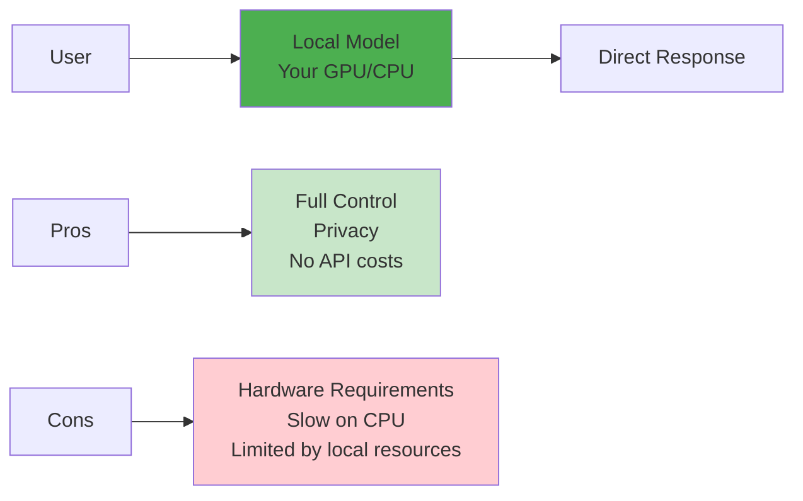
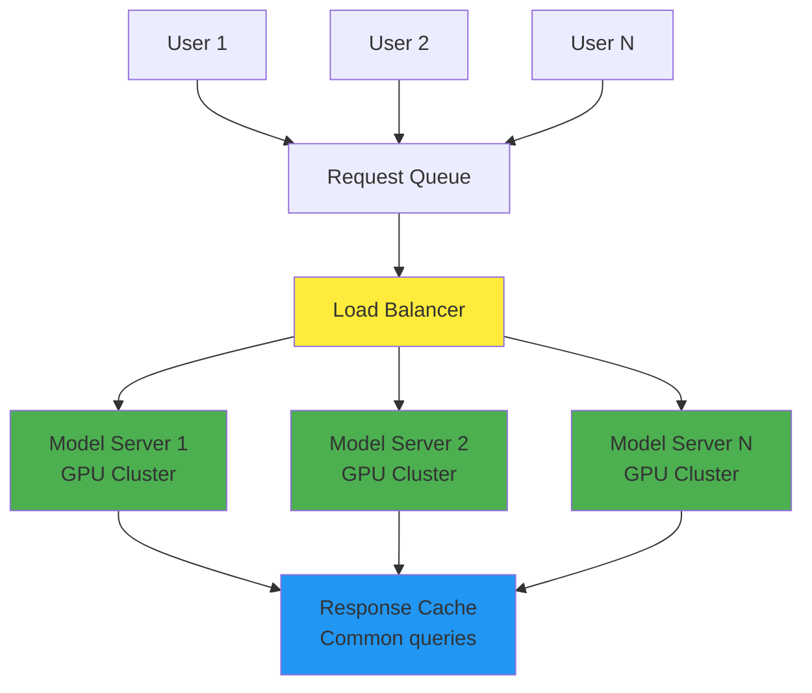
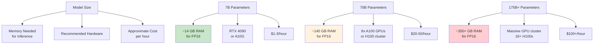
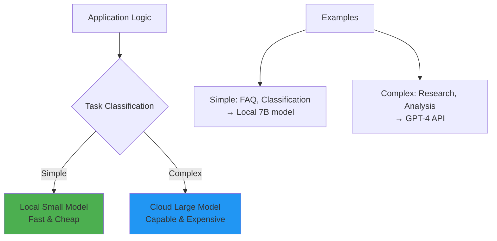
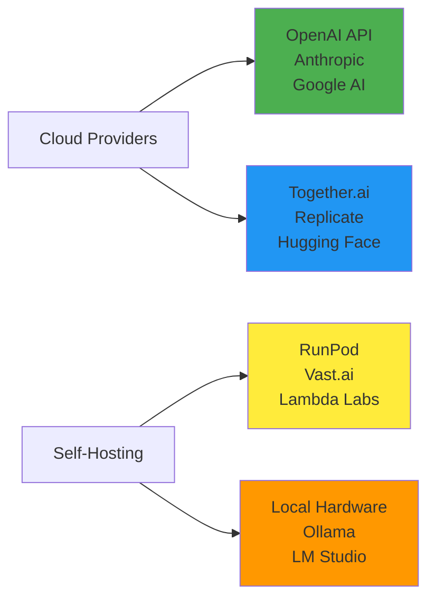
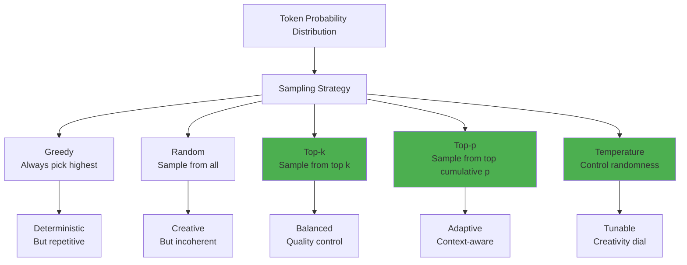
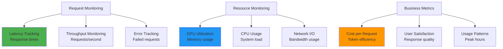
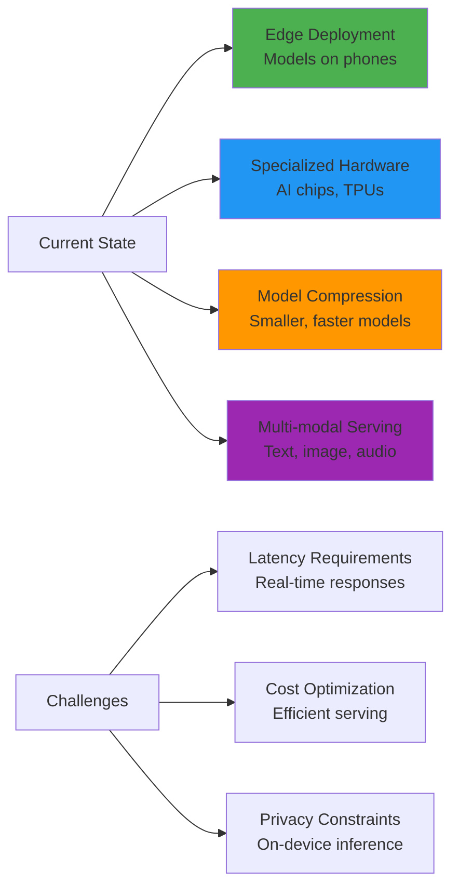

# Chapter 8: Deployment and Inference

## 🎯 What You'll Learn

- How trained models are deployed and served
- The inference process: from prompt to response
- Computational requirements and optimization
- Different ways to access and use LLMs
- Model serving architectures and challenges

## 🚀 From Training to Production

Once we have a trained model (base, SFT, or RL), we need to deploy it for users to interact with. This involves significant engineering challenges.



## 🔄 The Inference Process

### Step-by-Step: From User Input to Response

```mermaid
graph TD
    A[User Types Message<br/>"What is 2+2?"] --> B[Tokenization<br/>Convert to numbers]
    B --> C[Context Building<br/>Add special tokens]
    C --> D[Forward Pass<br/>Neural network computation]
    D --> E[Next Token Prediction<br/>Probability distribution]
    E --> F[Token Sampling<br/>Pick next token]
    F --> G[Detokenization<br/>Convert back to text]
    G --> H{End of response?}
    H -->|No| I[Add token to context]
    I --> D
    H -->|Yes| J[Return complete response]
    
    style D fill:#ffeb3b
    style F fill:#4caf50
    style J fill:#2196f3
```

### What Happens Behind the Scenes

```python
def generate_response(model, tokenizer, user_input, max_tokens=100):
    """
    Simplified inference process for language models
    """
    # 1. Tokenize input
    input_tokens = tokenizer.encode(user_input)
    
    # 2. Initialize context
    context = input_tokens
    
    # 3. Generate tokens one by one
    for _ in range(max_tokens):
        # Forward pass through neural network
        logits = model(context)
        
        # Get probabilities for next token
        probabilities = softmax(logits[-1])  # Last position
        
        # Sample next token (with some randomness)
        next_token = sample_from_distribution(probabilities)
        
        # Add to context
        context.append(next_token)
        
        # Check if we hit end token
        if next_token == tokenizer.eos_token:
            break
    
    # 4. Convert back to text
    response_tokens = context[len(input_tokens):]
    response = tokenizer.decode(response_tokens)
    
    return response

# Example usage
user_input = "What is the capital of France?"
response = generate_response(model, tokenizer, user_input)
print(response)  # "The capital of France is Paris."
```

## 🏗️ Model Serving Architecture

### Single-User Serving (Development)



### Production Serving (Millions of Users)



## ⚡ Performance Optimizations

### 1. Batching Requests

```python
class BatchedInference:
    def __init__(self, model, max_batch_size=8):
        self.model = model
        self.max_batch_size = max_batch_size
        self.pending_requests = []
    
    def add_request(self, prompt, callback):
        """Add a request to the batch queue"""
        self.pending_requests.append((prompt, callback))
        
        if len(self.pending_requests) >= self.max_batch_size:
            self.process_batch()
    
    def process_batch(self):
        """Process multiple requests together for efficiency"""
        if not self.pending_requests:
            return
        
        # Tokenize all prompts
        prompts = [req[0] for req in self.pending_requests]
        callbacks = [req[1] for req in self.pending_requests]
        
        # Batch tokenization
        tokenized_prompts = self.tokenizer.batch_encode(prompts)
        
        # Single forward pass for all requests
        responses = self.model.batch_generate(tokenized_prompts)
        
        # Send responses back
        for callback, response in zip(callbacks, responses):
            callback(response)
        
        self.pending_requests = []
```

### 2. Key-Value Caching

```mermaid
graph LR
    A[Previous Tokens<br/>Computed Once] --> B[Cached K,V Values<br/>Reuse computation]
    B --> C[New Token<br/>Only compute new]
    C --> D[Faster Generation<br/>Linear vs Quadratic]
    
    E[Without Cache] --> F[Recompute Everything<br/>O(n²) for n tokens]
    G[With Cache] --> H[Compute Only New<br/>O(n) for n tokens]
    
    style B fill:#4caf50
    style D fill:#4caf50
    style H fill:#4caf50
```

### 3. Model Quantization

```python
# Model weights stored with reduced precision
class QuantizedModel:
    def __init__(self, original_model):
        # Convert 32-bit floats to 8-bit integers
        self.quantized_weights = self.quantize_weights(original_model.weights)
        self.scaling_factors = self.compute_scaling_factors()
    
    def quantize_weights(self, weights):
        """Convert 32-bit to 8-bit representation"""
        # Scale to 8-bit range [-128, 127]
        return np.round(weights * 127 / np.max(np.abs(weights))).astype(np.int8)
    
    def forward(self, inputs):
        """Inference with quantized weights"""
        # Dequantize during computation
        full_precision_weights = self.quantized_weights * self.scaling_factors
        return self.compute_forward_pass(inputs, full_precision_weights)

# Benefits: 4x less memory, faster inference, minimal quality loss
```

## 💰 Cost Considerations

### Hardware Requirements by Model Size



### Cost Optimization Strategies

```python
# 1. Model selection based on task complexity
def choose_model(task_complexity):
    if task_complexity == "simple":
        return "gpt-3.5-turbo"  # Cheaper, faster
    elif task_complexity == "moderate":
        return "gpt-4"  # More capable
    else:
        return "gpt-4-turbo"  # Most capable

# 2. Prompt optimization
def optimize_prompt(original_prompt):
    """Shorter prompts = lower costs"""
    # Remove unnecessary words
    # Use bullet points instead of paragraphs
    # Be specific and direct
    return compressed_prompt

# 3. Response caching
cache = {}
def cached_llm_call(prompt):
    if prompt in cache:
        return cache[prompt]  # Free!
    
    response = expensive_llm_call(prompt)
    cache[prompt] = response
    return response
```

## 🌐 Ways to Access LLMs

### 1. Cloud APIs (Most Common)

```python
# OpenAI API example
import openai

client = openai.OpenAI(api_key="your-api-key")

response = client.chat.completions.create(
    model="gpt-4",
    messages=[
        {"role": "user", "content": "Explain quantum computing"}
    ]
)

print(response.choices[0].message.content)
```

**Pros:**
- No hardware requirements
- Latest models available
- Managed infrastructure
- Pay-per-use pricing

**Cons:**
- Data sent to third party
- Ongoing costs
- API rate limits
- Internet dependency

### 2. Local Deployment

```python
# Using Hugging Face Transformers
from transformers import AutoModelForCausalLM, AutoTokenizer

model_name = "microsoft/DialoGPT-medium"
tokenizer = AutoTokenizer.from_pretrained(model_name)
model = AutoModelForCausalLM.from_pretrained(model_name)

def local_chat(user_input):
    inputs = tokenizer.encode(user_input, return_tensors="pt")
    outputs = model.generate(inputs, max_length=1000, pad_token_id=tokenizer.eos_token_id)
    response = tokenizer.decode(outputs[0], skip_special_tokens=True)
    return response
```

**Pros:**
- Full data privacy
- No ongoing API costs
- Complete control
- Offline capability

**Cons:**
- Requires powerful hardware
- Model management overhead
- Limited to open models
- Technical complexity

### 3. Hybrid Approaches



## 🔧 Popular Deployment Platforms

### For Developers



### Model Hosting Solutions

```python
# Example: Deploying with Hugging Face Inference Endpoints
from huggingface_hub import InferenceClient

client = InferenceClient(model="your-model-name")

def query_model(prompt):
    return client.text_generation(
        prompt=prompt,
        max_new_tokens=100,
        temperature=0.7
    )

# Example: Using Ollama for local deployment
import ollama

def local_query(prompt):
    response = ollama.chat(
        model='llama2',
        messages=[{'role': 'user', 'content': prompt}]
    )
    return response['message']['content']
```

## 🎛️ Configuration and Fine-tuning Inference

### Generation Parameters

```python
# Control how the model generates text
generation_config = {
    "temperature": 0.7,      # Randomness (0=deterministic, 1=creative)
    "top_p": 0.9,           # Nucleus sampling (quality control)
    "top_k": 50,            # Limit vocabulary per step
    "max_tokens": 150,      # Response length limit
    "stop_sequences": ["\n\n"],  # When to stop generating
    "frequency_penalty": 0.1,    # Avoid repetition
    "presence_penalty": 0.1      # Encourage topic diversity
}

def generate_with_config(prompt, config):
    return model.generate(prompt, **config)
```

### Different Sampling Strategies



## 📊 Monitoring and Analytics

### Key Metrics to Track

```python
class InferenceMetrics:
    def __init__(self):
        self.latency_p95 = 0      # 95th percentile response time
        self.throughput_rps = 0    # Requests per second
        self.error_rate = 0        # Failed requests %
        self.token_rate = 0        # Tokens generated per second
        self.cost_per_request = 0  # Average cost
        self.gpu_utilization = 0   # Hardware efficiency
    
    def log_request(self, start_time, end_time, tokens_generated, success):
        latency = end_time - start_time
        # Update metrics...
        
    def get_dashboard_data(self):
        return {
            "performance": self.latency_p95,
            "throughput": self.throughput_rps,
            "reliability": 100 - self.error_rate,
            "efficiency": self.gpu_utilization
        }
```

### Performance Dashboard



## 🚀 Future of Model Deployment

### Emerging Trends



## 🎯 Key Insights

1. **Inference is expensive**: Serving large models requires significant compute
2. **Optimization matters**: Batching, caching, and quantization can dramatically improve efficiency
3. **Trade-offs everywhere**: Speed vs quality, cost vs capability, privacy vs convenience
4. **Architecture is crucial**: Good serving infrastructure enables good user experience

## ❓ Questions for Reflection

1. How do the computational requirements for training vs inference compare?
2. What are the privacy implications of different deployment approaches?
3. How might edge deployment change the landscape of AI applications?
4. What role will specialized AI hardware play in the future?

## 🔗 Next Chapter

Now that we understand how models are deployed and used, let's explore what they can and cannot do. In [Chapter 9](../09-capabilities-limitations/README.md), we'll examine the capabilities and limitations of current LLMs, including the important topic of hallucinations.

---

*Deployment is where rubber meets the road - turning research breakthroughs into practical tools that millions can use.*
