# Chapter 9: Capabilities and Limitations

## 🎯 What You'll Learn

- What LLMs can and cannot do well
- Understanding hallucinations and their causes
- Cognitive biases and psychological effects
- Edge cases and failure modes
- How to work effectively within LLM limitations

## 🧠 Understanding LLM Psychology

LLMs have emergent behaviors that arise from their training process. Understanding these "cognitive patterns" helps us use them more effectively.

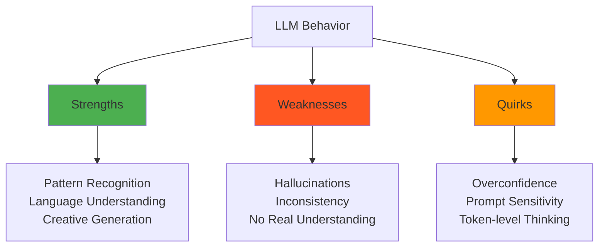

## ✅ What LLMs Excel At

### 1. Language Understanding and Generation

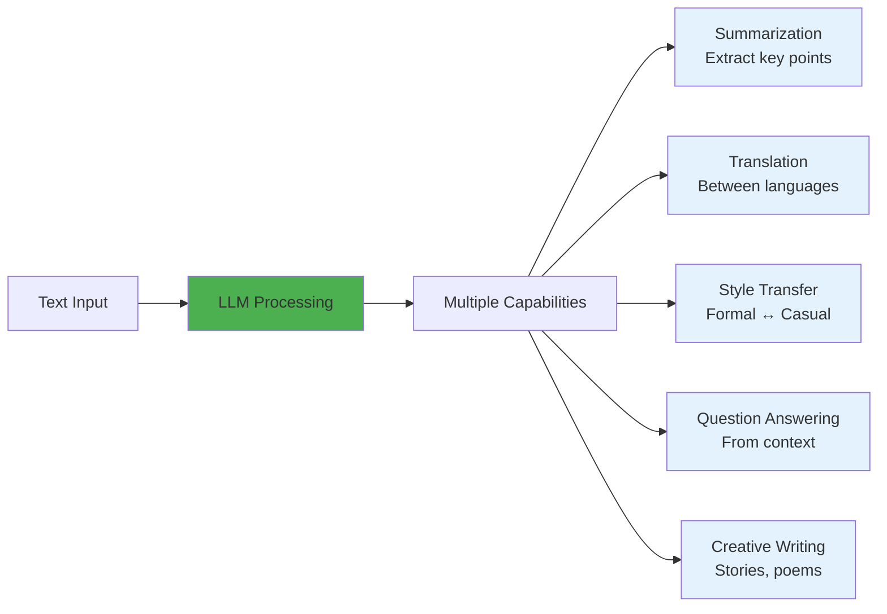

### 2. Pattern Recognition in Text

```python
# Examples of what LLMs excel at
examples = {
    "Code completion": {
        "input": "def fibonacci(n):",
        "llm_output": """
        if n <= 1:
            return n
        return fibonacci(n-1) + fibonacci(n-2)
        """
    },
    
    "Format conversion": {
        "input": "Convert to JSON: Name: John, Age: 30, City: NYC",
        "llm_output": '{"name": "John", "age": 30, "city": "NYC"}'
    },
    
    "Text analysis": {
        "input": "Analyze sentiment: 'I love this product!'",
        "llm_output": "Positive sentiment (enthusiastic, expressing satisfaction)"
    }
}
```

### 3. Few-Shot Learning

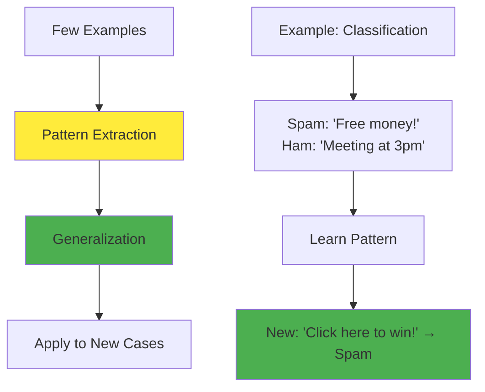

## ❌ What LLMs Struggle With

### 1. Hallucinations: The Confident Confabulator

LLMs sometimes generate false information with complete confidence. This happens because they're trained to always produce plausible-sounding text.

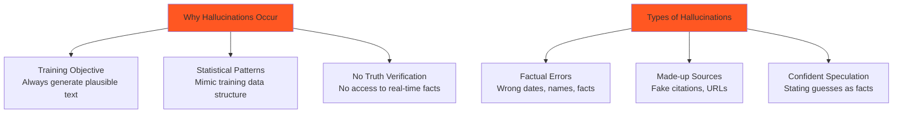

#### Examples of Hallucinations

```python
# Common hallucination patterns
hallucination_examples = {
    "fake_facts": {
        "prompt": "When was the Battle of Hastings?",
        "correct": "1066",
        "hallucination": "1067 - The model might confidently state wrong dates"
    },
    
    "made_up_people": {
        "prompt": "Tell me about Dr. Sarah Johnson's research on quantum computing",
        "issue": "Model invents a fictional researcher and describes fake research"
    },
    
    "fake_citations": {
        "prompt": "Cite sources for climate change data",
        "issue": "Model generates realistic-looking but non-existent paper titles and URLs"
    }
}
```

### 2. Computational Limitations

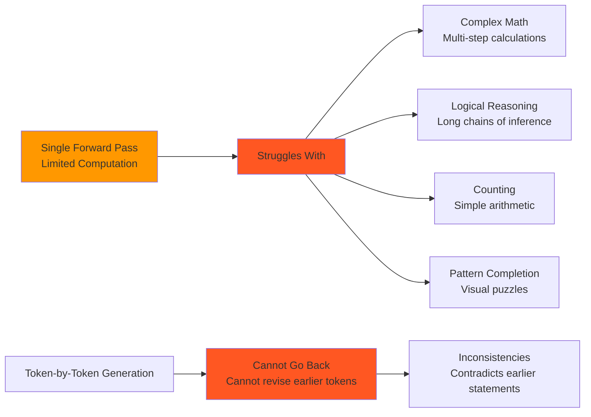

#### Examples of Computational Failures

```python
def test_llm_counting():
    """Examples where LLMs often fail"""
    
    examples = [
        {
            "task": "Count the 'r's in 'strawberry'",
            "correct_answer": "3",
            "common_llm_error": "2 (misses the 'r' in the middle)"
        },
        {
            "task": "What's 17 * 23?",
            "correct_answer": "391",
            "llm_behavior": "May give wrong answer without showing work"
        },
        {
            "task": "Every third letter in 'ABCDEFGHIJK'",
            "correct_answer": "C, F, I",
            "llm_challenge": "Has trouble with systematic patterns"
        }
    ]
    
    return examples
```

### 3. Inconsistency and Context Limitations

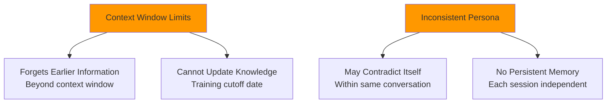

## 🎭 Cognitive Biases and Quirks

### 1. Overconfidence Bias

```python
class LLMBehaviorPatterns:
    """Common psychological patterns in LLM responses"""
    
    def overconfidence_example(self):
        return {
            "pattern": "States uncertain information with high confidence",
            "example": {
                "prompt": "What will the weather be like tomorrow?",
                "llm_response": "Tomorrow will be sunny with temperatures reaching 75°F",
                "issue": "Cannot actually predict weather, but sounds confident"
            }
        }
    
    def recency_bias(self):
        return {
            "pattern": "More influenced by recent training data",
            "impact": "May reflect more recent cultural trends and biases"
        }
    
    def prompt_sensitivity(self):
        return {
            "pattern": "Small prompt changes cause large output changes",
            "example": "Adding 'think step by step' dramatically improves reasoning"
        }
```

### 2. Statistical Mimicry vs Understanding

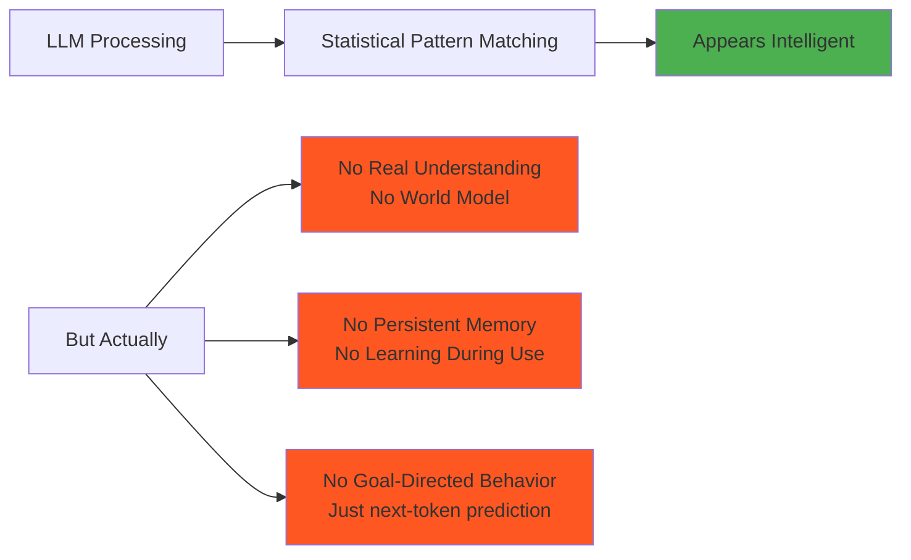

## 🛠️ Mitigation Strategies

### 1. Reducing Hallucinations

```python
def reduce_hallucinations():
    """Strategies to minimize false information"""
    
    strategies = {
        "retrieval_augmented_generation": {
            "concept": "Provide relevant documents with the prompt",
            "example": "Include Wikipedia article, then ask question about it"
        },
        
        "explicit_uncertainty": {
            "concept": "Prompt model to express uncertainty",
            "prompt": "If you're not certain, please say 'I don't know' or 'I'm not sure'"
        },
        
        "verification_prompts": {
            "concept": "Ask model to verify its own claims",
            "approach": "After response, ask 'Are you certain about these facts?'"
        },
        
        "external_validation": {
            "concept": "Check important facts against reliable sources",
            "tools": "Search engines, databases, fact-checking services"
        }
    }
    
    return strategies

# Example: RAG (Retrieval-Augmented Generation)
def rag_approach(question, knowledge_base):
    """Reduce hallucinations by providing context"""
    
    # 1. Retrieve relevant documents
    relevant_docs = search_knowledge_base(question, knowledge_base)
    
    # 2. Create enhanced prompt
    enhanced_prompt = f"""
    Based on the following information:
    {relevant_docs}
    
    Question: {question}
    
    Please answer based only on the provided information. 
    If the answer isn't in the provided text, say "I don't have enough information."
    """
    
    # 3. Generate response
    response = llm.generate(enhanced_prompt)
    return response
```

### 2. Working with Computational Limitations

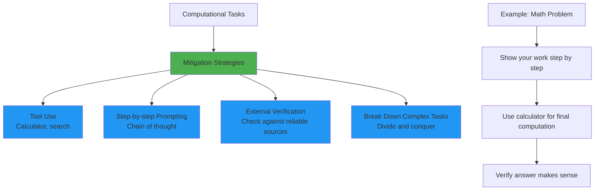

### 3. Prompt Engineering Best Practices

```python
class PromptEngineering:
    """Best practices for effective LLM interaction"""
    
    def clear_instructions(self):
        return {
            "bad": "Write something about dogs",
            "good": "Write a 200-word informative paragraph about dog breeds, focusing on temperament differences"
        }
    
    def provide_context(self):
        return {
            "bad": "What should I do?",
            "good": "I'm a software engineer considering a career change to data science. What steps should I take?"
        }
    
    def specify_format(self):
        return {
            "bad": "List programming languages",
            "good": "List 5 programming languages in this format: Language: [Name], Use case: [Description]"
        }
    
    def use_examples(self):
        return {
            "technique": "Few-shot prompting",
            "example": """
            Classify sentiment:
            
            Text: "I love this movie!" 
            Sentiment: Positive
            
            Text: "This is terrible."
            Sentiment: Negative
            
            Text: "The weather is okay I guess."
            Sentiment: [Model completes this]
            """
        }
```

## 🔍 Testing and Evaluation

### LLM Evaluation Framework

```python
class LLMEvaluator:
    """Framework for testing LLM capabilities and limitations"""
    
    def __init__(self):
        self.test_categories = {
            "factual_accuracy": self.test_factual_knowledge,
            "reasoning": self.test_logical_reasoning,
            "consistency": self.test_response_consistency,
            "safety": self.test_harmful_content,
            "bias": self.test_demographic_bias
        }
    
    def test_factual_knowledge(self, model):
        """Test for hallucinations and factual errors"""
        test_cases = [
            {"q": "When was Python created?", "answer": "1991"},
            {"q": "Who wrote '1984'?", "answer": "George Orwell"},
            {"q": "What's the capital of Australia?", "answer": "Canberra"}
        ]
        
        results = []
        for case in test_cases:
            response = model.generate(case["q"])
            accuracy = self.check_factual_accuracy(response, case["answer"])
            results.append({"question": case["q"], "accurate": accuracy})
        
        return results
    
    def test_logical_reasoning(self, model):
        """Test multi-step reasoning abilities"""
        logic_problems = [
            "If all roses are flowers, and some flowers are red, can we conclude that some roses are red?",
            "A bat and a ball cost $1.10 in total. The bat costs $1 more than the ball. How much does the ball cost?"
        ]
        
        # Evaluate logical consistency and correctness
        return self.evaluate_reasoning(model, logic_problems)
    
    def test_response_consistency(self, model):
        """Test if model gives consistent answers to same question"""
        question = "What's the most important programming principle?"
        responses = [model.generate(question) for _ in range(5)]
        
        consistency_score = self.measure_consistency(responses)
        return consistency_score
```

### Benchmark Results Visualization

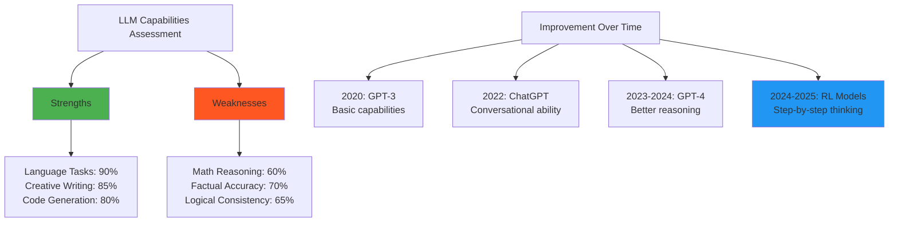

## 🎯 Application-Specific Considerations

### When to Use vs Avoid LLMs

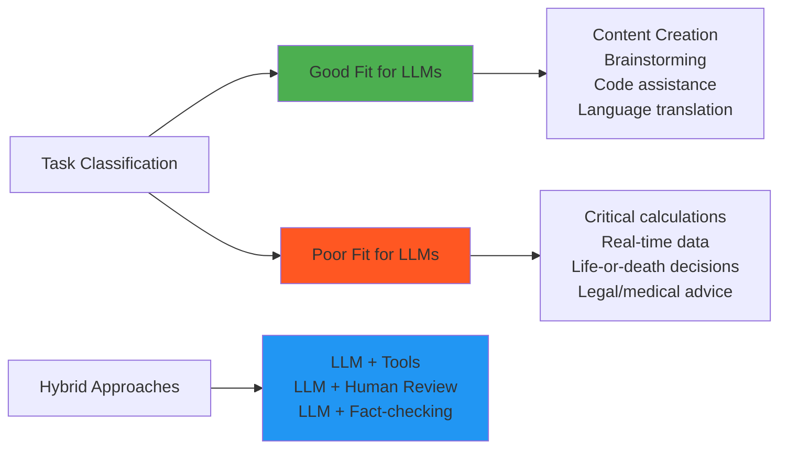

### Risk Assessment Matrix

```python
def assess_llm_risk(use_case):
    """Evaluate risk level for LLM application"""
    
    risk_factors = {
        "accuracy_requirement": ["low", "medium", "high", "critical"],
        "hallucination_tolerance": ["high", "medium", "low", "none"],
        "consequences_of_error": ["minor", "moderate", "severe", "catastrophic"],
        "human_oversight": ["none", "minimal", "moderate", "full"]
    }
    
    risk_matrix = {
        ("high", "none", "catastrophic", "none"): "DO NOT USE",
        ("medium", "low", "severe", "minimal"): "HIGH RISK",
        ("low", "medium", "moderate", "moderate"): "MEDIUM RISK",
        ("low", "high", "minor", "full"): "LOW RISK"
    }
    
    # Evaluate specific use case...
    return risk_assessment

# Examples
examples = {
    "content_generation": "LOW RISK - Creative, human review",
    "medical_diagnosis": "DO NOT USE - Life critical, high accuracy needed",
    "code_review": "MEDIUM RISK - Important but reviewable",
    "customer_service": "LOW-MEDIUM RISK - Human escalation available"
}
```

## 🔮 Future Improvements

### Active Research Areas

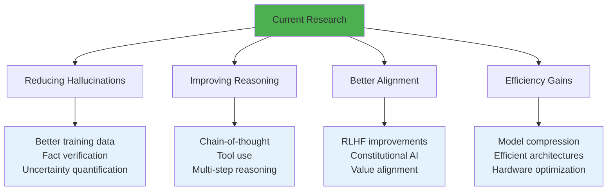

## 🎯 Key Insights

1. **LLMs are powerful but flawed**: Exceptional at language tasks, but prone to hallucinations
2. **Context matters enormously**: Small prompt changes can dramatically affect output quality
3. **They simulate understanding**: Statistical patterns create appearance of intelligence
4. **Mitigation strategies work**: RAG, tool use, and human oversight significantly improve reliability
5. **Know your use case**: High-stakes applications require special care and validation

## ❓ Questions for Reflection

1. How can we better communicate LLM limitations to end users?
2. What types of safeguards should be built into LLM applications?
3. How might LLM capabilities change as models get larger and training improves?
4. What's the right balance between LLM autonomy and human oversight?

## 🔗 Next Chapter

Understanding capabilities and limitations prepares us to use LLMs effectively. In [Chapter 10](../10-practical-usage/README.md), we'll explore practical strategies for incorporating LLMs into your workflow and accessing different models.

---

*Understanding what LLMs can and cannot do is crucial for building trust and using them effectively. They're powerful tools, not infallible oracles.*
