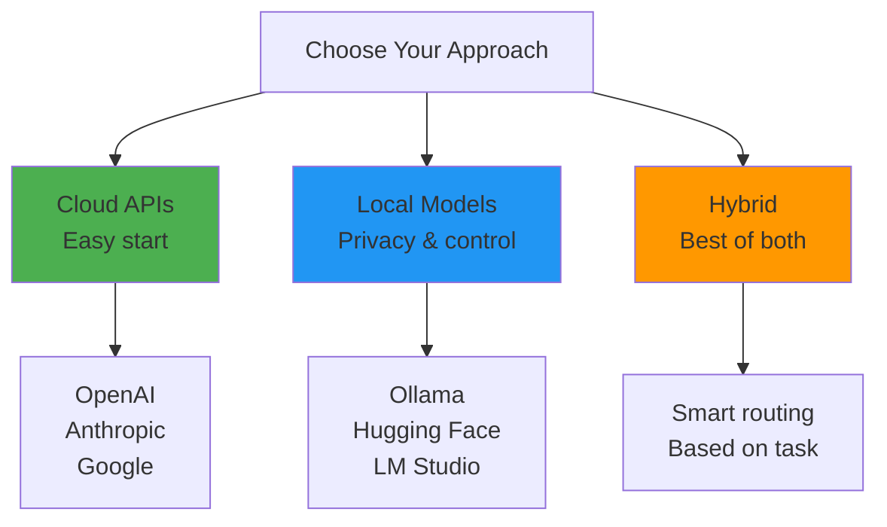
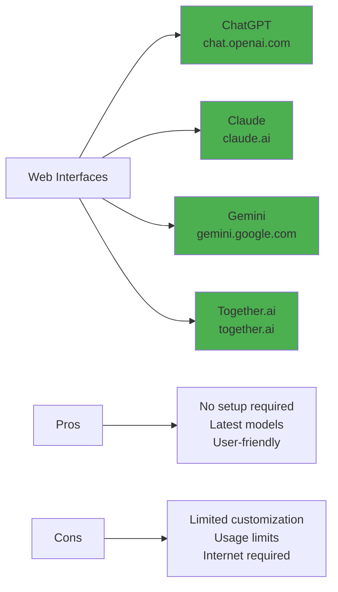
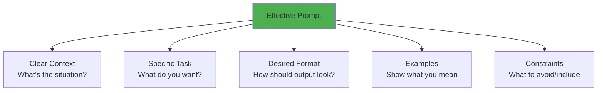
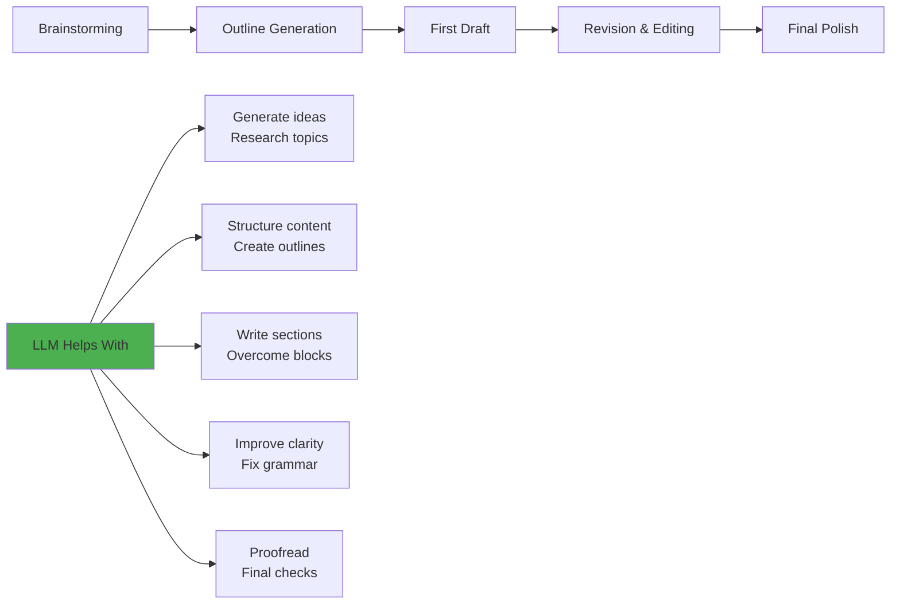
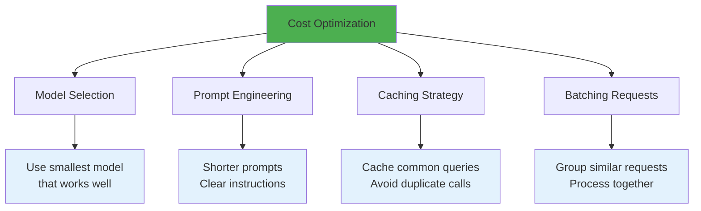
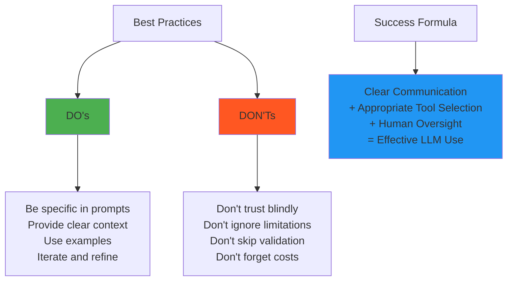

# Chapter 10: Practical Usage and Tools

## 🎯 What You'll Learn

- How to effectively use LLMs in your daily work
- Different ways to access and interact with models
- Prompt engineering best practices
- Integration strategies for applications
- Cost-effective usage patterns

## 🚀 Getting Started with LLMs

Whether you're a developer, researcher, student, or professional, LLMs can enhance your productivity when used correctly.



## 🛠️ Popular Tools and Platforms

### 1. Web Interfaces (Easiest Start)



### 2. API Integration (For Developers)

```python
# OpenAI API Example
import openai

client = openai.OpenAI(api_key="your-api-key")

def ai_assistant(prompt, model="gpt-4"):
    """Basic AI assistant function"""
    response = client.chat.completions.create(
        model=model,
        messages=[
            {"role": "system", "content": "You are a helpful assistant."},
            {"role": "user", "content": prompt}
        ],
        temperature=0.7,
        max_tokens=150
    )
    return response.choices[0].message.content

# Usage examples
code_help = ai_assistant("Explain Python list comprehensions")
writing_help = ai_assistant("Improve this sentence: 'The thing was good'")
```

### 3. Local Model Tools

```python
# Ollama - Local model runner
import ollama

# Download and run models locally
def local_ai_chat(message, model="llama2"):
    """Chat with local model via Ollama"""
    response = ollama.chat(
        model=model,
        messages=[{'role': 'user', 'content': message}]
    )
    return response['message']['content']

# Hugging Face Transformers
from transformers import pipeline

# Create a local text generation pipeline
generator = pipeline('text-generation', model='gpt2')

def generate_text(prompt, max_length=100):
    """Generate text using local model"""
    result = generator(prompt, max_length=max_length, num_return_sequences=1)
    return result[0]['generated_text']
```

## 📝 Prompt Engineering Mastery

### The Anatomy of a Good Prompt



### Prompt Templates for Common Tasks

```python
class PromptTemplates:
    """Reusable prompt templates for common tasks"""
    
    @staticmethod
    def code_review(code, language):
        return f"""
        Review this {language} code for:
        1. Bugs or errors
        2. Performance issues
        3. Best practices
        4. Security concerns
        
        Code:
        ```{language}
        {code}
        ```
        
        Provide specific feedback with explanations.
        """
    
    @staticmethod
    def writing_improvement(text, style="professional"):
        return f"""
        Improve this text to be more {style}:
        
        Original: {text}
        
        Requirements:
        - Keep the core meaning
        - Improve clarity and flow
        - Fix grammar/spelling
        - Make it more {style}
        
        Improved version:
        """
    
    @staticmethod
    def data_analysis(data_description, question):
        return f"""
        I have a dataset with: {data_description}
        
        Question: {question}
        
        Please suggest:
        1. Appropriate analysis methods
        2. Python code to perform the analysis
        3. How to interpret results
        4. Potential limitations
        """
    
    @staticmethod
    def learning_assistant(topic, level="beginner"):
        return f"""
        Explain {topic} for a {level} level learner.
        
        Structure your response as:
        1. Simple definition
        2. Key concepts (3-5 points)
        3. Real-world example
        4. Common misconceptions
        5. Next steps for learning
        
        Use analogies and clear language.
        """
```

### Advanced Prompting Techniques

```python
def chain_of_thought_prompting(problem):
    """Encourage step-by-step reasoning"""
    return f"""
    Solve this problem step by step:
    
    Problem: {problem}
    
    Let's think about this step by step:
    1. First, I need to understand what's being asked...
    2. Then, I should identify the key information...
    3. Next, I'll work through the solution...
    4. Finally, I'll verify my answer...
    """

def few_shot_prompting(task_examples, new_task):
    """Provide examples before the actual task"""
    examples_text = "\n\n".join([
        f"Input: {ex['input']}\nOutput: {ex['output']}" 
        for ex in task_examples
    ])
    
    return f"""
    Here are some examples of the task:
    
    {examples_text}
    
    Now do the same for:
    Input: {new_task}
    Output:
    """

def role_prompting(role, task):
    """Ask the model to take on a specific role"""
    return f"""
    You are a {role}. {task}
    
    Respond in character, using the knowledge, perspective, 
    and communication style typical of a {role}.
    """

# Usage examples
math_problem = chain_of_thought_prompting("If a train travels 60 mph for 2.5 hours, how far does it go?")

sentiment_examples = [
    {"input": "I love this product!", "output": "Positive"},
    {"input": "This is terrible.", "output": "Negative"},
    {"input": "It's okay, I guess.", "output": "Neutral"}
]
new_sentiment = few_shot_prompting(sentiment_examples, "The movie was amazing!")

expert_advice = role_prompting("senior software architect", 
                               "Design a scalable microservices architecture for an e-commerce platform")
```

## 🔄 Workflow Integration Patterns

### 1. Writing and Content Creation



```python
class WritingAssistant:
    """LLM-powered writing workflow"""
    
    def brainstorm(self, topic, count=10):
        """Generate ideas for a topic"""
        prompt = f"Generate {count} creative ideas about {topic}. List them as bullet points."
        return self.llm.generate(prompt)
    
    def create_outline(self, topic, audience, length):
        """Generate content outline"""
        prompt = f"""
        Create a detailed outline for a {length} piece about {topic} 
        for {audience}. Include:
        - Main sections
        - Key points for each section
        - Suggested word counts
        """
        return self.llm.generate(prompt)
    
    def draft_section(self, outline_section, style="informative"):
        """Write a section based on outline"""
        prompt = f"""
        Write a {style} section based on this outline point:
        {outline_section}
        
        Make it engaging and well-structured with clear examples.
        """
        return self.llm.generate(prompt)
    
    def improve_text(self, text, goal="clarity"):
        """Improve existing text"""
        prompt = f"""
        Improve this text for {goal}:
        
        {text}
        
        Keep the core message but make it more {goal}.
        """
        return self.llm.generate(prompt)
```

### 2. Code Development Workflow

```python
class CodingAssistant:
    """LLM integration for software development"""
    
    def explain_code(self, code, language):
        """Get explanation of existing code"""
        return f"""
        Explain what this {language} code does:
        
        ```{language}
        {code}
        ```
        
        Include:
        - Overall purpose
        - Step-by-step breakdown
        - Key algorithms/patterns used
        - Potential improvements
        """
    
    def generate_function(self, description, language="python"):
        """Generate function from description"""
        return f"""
        Write a {language} function that {description}.
        
        Requirements:
        - Include proper documentation
        - Add type hints (if applicable)
        - Include error handling
        - Provide usage example
        """
    
    def debug_help(self, error_message, code_context):
        """Get debugging assistance"""
        return f"""
        I'm getting this error:
        {error_message}
        
        In this code context:
        {code_context}
        
        Please:
        1. Explain what's causing the error
        2. Suggest specific fixes
        3. Provide corrected code
        4. Explain how to prevent similar issues
        """
    
    def code_review(self, code, focus="general"):
        """Request code review"""
        return f"""
        Review this code focusing on {focus}:
        
        {code}
        
        Check for:
        - Correctness and bugs
        - Performance issues
        - Security vulnerabilities
        - Code style and best practices
        - Maintainability
        
        Provide specific suggestions for improvement.
        """
```

### 3. Research and Learning

```python
class ResearchAssistant:
    """LLM tools for research and learning"""
    
    def summarize_article(self, article_text, focus="key_points"):
        """Summarize long-form content"""
        return f"""
        Summarize this article focusing on {focus}:
        
        {article_text}
        
        Provide:
        - Main thesis/argument
        - Key supporting points
        - Important evidence/data
        - Conclusions
        
        Keep summary concise but comprehensive.
        """
    
    def compare_concepts(self, concept1, concept2, domain):
        """Compare two concepts or approaches"""
        return f"""
        Compare and contrast {concept1} vs {concept2} in {domain}.
        
        Structure as:
        1. Brief definition of each
        2. Similarities
        3. Key differences
        4. Pros and cons of each
        5. When to use which
        
        Use examples to illustrate points.
        """
    
    def learning_plan(self, subject, current_level, goal, timeframe):
        """Create personalized learning plan"""
        return f"""
        Create a {timeframe} learning plan for {subject}.
        
        Current level: {current_level}
        Goal: {goal}
        
        Include:
        - Weekly milestones
        - Recommended resources
        - Practice exercises
        - Progress checkpoints
        - Common pitfalls to avoid
        """
```

## 💰 Cost Optimization Strategies

### Understanding API Pricing

```python
class CostOptimizer:
    """Tools for optimizing LLM usage costs"""
    
    def __init__(self):
        # Example pricing (varies by provider)
        self.pricing = {
            "gpt-4": {"input": 0.03, "output": 0.06},  # per 1K tokens
            "gpt-3.5-turbo": {"input": 0.0015, "output": 0.002},
            "claude-3": {"input": 0.025, "output": 0.075}
        }
    
    def estimate_cost(self, text, model, operation="both"):
        """Estimate cost for a text operation"""
        tokens = self.count_tokens(text)
        
        if operation == "input":
            cost = tokens * self.pricing[model]["input"] / 1000
        elif operation == "output":
            cost = tokens * self.pricing[model]["output"] / 1000
        else:  # both
            cost = tokens * (self.pricing[model]["input"] + self.pricing[model]["output"]) / 1000
        
        return cost
    
    def choose_model(self, task_complexity, budget="medium"):
        """Recommend model based on task and budget"""
        if budget == "low":
            return "gpt-3.5-turbo"
        elif task_complexity == "high":
            return "gpt-4"
        else:
            return "gpt-3.5-turbo"
    
    def optimize_prompt(self, original_prompt):
        """Suggestions for reducing prompt length"""
        optimizations = {
            "remove_redundancy": "Remove repeated information",
            "use_abbreviations": "Use common abbreviations",
            "bullet_points": "Use bullet points instead of paragraphs",
            "essential_only": "Include only essential context"
        }
        return optimizations

# Cost-saving techniques
def smart_caching():
    """Cache common responses to avoid repeated API calls"""
    cache = {}
    
    def cached_llm_call(prompt, model="gpt-3.5-turbo"):
        cache_key = f"{model}:{hash(prompt)}"
        
        if cache_key in cache:
            return cache[cache_key]  # Free!
        
        response = api_call(prompt, model)
        cache[cache_key] = response
        return response
    
    return cached_llm_call

def batch_processing(requests, batch_size=10):
    """Process multiple requests together"""
    batched_results = []
    
    for i in range(0, len(requests), batch_size):
        batch = requests[i:i + batch_size]
        
        # Combine requests into single API call
        combined_prompt = "\n---\n".join([
            f"Request {j+1}: {req}" for j, req in enumerate(batch)
        ])
        
        response = api_call(combined_prompt)
        # Parse response back into individual results
        individual_results = parse_batch_response(response, len(batch))
        batched_results.extend(individual_results)
    
    return batched_results
```

### Usage Patterns and Best Practices



## 🔌 Integration Examples

### 1. Building a Simple AI Assistant

```python
import openai
import streamlit as st

class SimpleAIAssistant:
    def __init__(self, api_key):
        self.client = openai.OpenAI(api_key=api_key)
        self.conversation_history = []
    
    def chat(self, user_message):
        """Main chat function"""
        # Add user message to history
        self.conversation_history.append({"role": "user", "content": user_message})
        
        # Generate response
        response = self.client.chat.completions.create(
            model="gpt-3.5-turbo",
            messages=[
                {"role": "system", "content": "You are a helpful assistant."},
                *self.conversation_history
            ],
            temperature=0.7,
            max_tokens=500
        )
        
        assistant_message = response.choices[0].message.content
        
        # Add assistant response to history
        self.conversation_history.append({"role": "assistant", "content": assistant_message})
        
        return assistant_message
    
    def clear_history(self):
        """Reset conversation"""
        self.conversation_history = []

# Streamlit web interface
def main():
    st.title("AI Assistant")
    
    # Initialize assistant
    if 'assistant' not in st.session_state:
        api_key = st.secrets["OPENAI_API_KEY"]
        st.session_state.assistant = SimpleAIAssistant(api_key)
    
    # Chat interface
    user_input = st.text_input("Ask me anything:")
    
    if user_input:
        response = st.session_state.assistant.chat(user_input)
        st.write(f"Assistant: {response}")
    
    # Clear conversation button
    if st.button("Clear Conversation"):
        st.session_state.assistant.clear_history()
        st.rerun()

if __name__ == "__main__":
    main()
```

### 2. Document Analysis Tool

```python
class DocumentAnalyzer:
    """Analyze documents using LLMs"""
    
    def __init__(self, llm_client):
        self.llm = llm_client
    
    def summarize_document(self, document_text, summary_type="executive"):
        """Generate different types of summaries"""
        prompts = {
            "executive": "Create an executive summary highlighting key decisions and outcomes",
            "technical": "Provide a technical summary focusing on methods and implementation details",
            "bullet": "Summarize as concise bullet points covering main topics"
        }
        
        prompt = f"""
        {prompts.get(summary_type, prompts["executive"])}:
        
        Document:
        {document_text}
        
        Summary:
        """
        
        return self.llm.generate(prompt)
    
    def extract_key_info(self, document_text, info_type):
        """Extract specific information from documents"""
        prompts = {
            "dates": "Extract all dates and associated events",
            "people": "List all people mentioned and their roles",
            "numbers": "Extract all important numbers, statistics, and metrics",
            "decisions": "Identify key decisions made and their rationale",
            "action_items": "List all action items and responsibilities"
        }
        
        prompt = f"""
        From this document, {prompts[info_type]}:
        
        {document_text}
        
        Format as a clear, organized list.
        """
        
        return self.llm.generate(prompt)
    
    def compare_documents(self, doc1, doc2, comparison_focus="main_points"):
        """Compare two documents"""
        prompt = f"""
        Compare these two documents focusing on {comparison_focus}:
        
        Document 1:
        {doc1}
        
        Document 2:
        {doc2}
        
        Comparison:
        1. Similarities
        2. Key differences
        3. Unique points in each document
        4. Overall assessment
        """
        
        return self.llm.generate(prompt)
```

## 📊 Monitoring and Analytics

### Tracking LLM Usage

```python
import time
import json
from datetime import datetime

class LLMUsageTracker:
    """Track and analyze LLM usage patterns"""
    
    def __init__(self):
        self.usage_log = []
    
    def log_request(self, prompt, response, model, cost=None):
        """Log each LLM request"""
        log_entry = {
            "timestamp": datetime.now().isoformat(),
            "model": model,
            "prompt_length": len(prompt),
            "response_length": len(response),
            "cost": cost,
            "success": True
        }
        self.usage_log.append(log_entry)
    
    def get_usage_stats(self, period_days=30):
        """Analyze usage patterns"""
        recent_logs = [
            log for log in self.usage_log 
            if self._is_recent(log["timestamp"], period_days)
        ]
        
        total_requests = len(recent_logs)
        total_cost = sum(log["cost"] or 0 for log in recent_logs)
        avg_prompt_length = sum(log["prompt_length"] for log in recent_logs) / total_requests
        
        model_usage = {}
        for log in recent_logs:
            model = log["model"]
            model_usage[model] = model_usage.get(model, 0) + 1
        
        return {
            "total_requests": total_requests,
            "total_cost": total_cost,
            "avg_prompt_length": avg_prompt_length,
            "model_distribution": model_usage,
            "avg_cost_per_request": total_cost / total_requests if total_requests > 0 else 0
        }
    
    def _is_recent(self, timestamp_str, days):
        """Check if timestamp is within recent days"""
        timestamp = datetime.fromisoformat(timestamp_str)
        now = datetime.now()
        return (now - timestamp).days <= days

# Usage example
tracker = LLMUsageTracker()

def tracked_llm_call(prompt, model="gpt-3.5-turbo"):
    """Wrapper that tracks all LLM calls"""
    start_time = time.time()
    
    try:
        response = llm_api_call(prompt, model)
        cost = estimate_cost(prompt + response, model)
        
        tracker.log_request(prompt, response, model, cost)
        return response
        
    except Exception as e:
        # Log failed requests too
        tracker.log_request(prompt, "", model, 0)
        raise e
```

## 🎯 Best Practices Summary

### Do's and Don'ts



### Workflow Checklist

```python
def llm_project_checklist():
    """Checklist for implementing LLM solutions"""
    
    checklist = {
        "planning": [
            "Define clear objectives",
            "Identify success metrics",
            "Choose appropriate model",
            "Estimate costs",
            "Plan for edge cases"
        ],
        
        "implementation": [
            "Start with simple prompts",
            "Test with diverse inputs",
            "Implement error handling",
            "Add usage tracking",
            "Create feedback loop"
        ],
        
        "validation": [
            "Test accuracy on representative data",
            "Check for bias and harmful outputs",
            "Validate cost assumptions",
            "Ensure scalability",
            "Plan monitoring strategy"
        ],
        
        "deployment": [
            "Implement proper security",
            "Set up monitoring/alerts",
            "Create user documentation",
            "Plan maintenance schedule",
            "Prepare rollback plan"
        ]
    }
    
    return checklist
```

## 🎯 Key Takeaways

1. **Start simple**: Begin with web interfaces, then move to APIs as needed
2. **Prompt engineering matters**: Invest time in crafting effective prompts
3. **Monitor usage and costs**: Track what you're spending and getting value
4. **Combine approaches**: Use different models for different tasks
5. **Human in the loop**: Always have validation and oversight processes
6. **Iterate and improve**: Continuously refine based on results

## ❓ Questions for Reflection

1. How can LLMs enhance your current workflow without replacing human judgment?
2. What tasks in your work would benefit most from LLM assistance?
3. How do you balance the convenience of cloud APIs with privacy concerns?
4. What metrics would you use to measure the success of LLM integration?

## 🔗 Conclusion

Congratulations! You've completed the Deep Dive into Large Language Models. You now understand how these systems work from data collection through deployment, and you have practical tools for using them effectively.

Remember: LLMs are powerful tools that work best when combined with human expertise, clear objectives, and thoughtful implementation. Use them wisely!

---

*The goal isn't to replace human intelligence, but to augment it. LLMs are thinking partners, not thinking replacements.*
