# Deep Dive into Large Language Models (LLMs) like ChatGPT

This repository contains comprehensive educational materials based on Andrej Karpathy's excellent tutorial on how Large Language Models work. This course takes you from zero to expert understanding of LLMs, with theory, code examples, visual diagrams, and practical applications.

## 🎯 Learning Objectives

By the end of this course, you will understand:
- **The complete LLM pipeline**: From raw internet data to ChatGPT
- **The three training stages**: Pre-training, Supervised Fine-tuning, and Reinforcement Learning  
- **Technical details**: Tokenization, transformer architecture, and neural network internals
- **Practical skills**: How to use, deploy, and integrate LLMs effectively
- **Limitations and capabilities**: What LLMs can and cannot do, including hallucinations
- **Real-world applications**: Prompt engineering, cost optimization, and workflow integration

## 🌟 What Makes This Course Special

This isn't just a collection of notes - it's a structured learning experience featuring:

- **🎨 Visual Learning**: Rich mermaid diagrams that make complex concepts clear
- **💻 Hands-on Code**: Working Python examples you can run and modify
- **🧠 Mental Models**: Clear analogies and frameworks for understanding LLMs
- **⚡ Practical Focus**: Real-world applications and best practices
- **🔍 Deep Insights**: Based on Karpathy's expert perspective from OpenAI and Tesla
- **📚 Progressive Structure**: Each chapter builds on the previous ones

## 🎯 Course Structure Overview

```mermaid
graph TD
    A[🏁 Start Here] --> B[Ch 1: Introduction<br/>Mental Models & Overview]
    B --> C[Ch 2: Data Processing<br/>Internet → Training Data]
    C --> D[Ch 3: Tokenization<br/>Text → Numbers]
    D --> E[Ch 4: Architecture<br/>Neural Network Design]
    E --> F[Ch 5: Pre-training<br/>Learning Language Patterns]
    F --> G[Ch 6: Fine-tuning<br/>Becoming an Assistant]
    G --> H[Ch 7: Reinforcement Learning<br/>Advanced Reasoning]
    H --> I[Ch 8: Deployment<br/>Production Systems]
    I --> J[Ch 9: Limitations<br/>What Can Go Wrong]
    J --> K[Ch 10: Practical Usage<br/>Real-world Applications]
    
    style A fill:#ff6b6b
    style B fill:#4ecdc4
    style C fill:#45b7d1
    style D fill:#96ceb4
    style E fill:#feca57
    style F fill:#ff9ff3
    style G fill:#54a0ff
    style H fill:#5f27cd
    style I fill:#00d2d3
    style J fill:#ff9f43
    style K fill:#10ac84
```

## 📚 Detailed Chapter Guide

### [Chapter 1: Introduction and Overview](./01-introduction/README.md) 🏁
**Mental models for understanding LLMs**
- What LLMs really are (hint: sophisticated autocomplete)
- The three-stage training pipeline analogy
- Why they sometimes fail at simple tasks but excel at complex ones
- *Key insight: LLMs are internet document simulators*

### [Chapter 2: Data Collection and Processing](./02-data-processing/README.md) 🌐
**From internet chaos to clean training data**
- How to download and filter 44TB of internet text
- Quality vs quantity trade-offs in data curation
- The Common Crawl pipeline and filtering stages
- *Key insight: Training data quality determines model capabilities*

### [Chapter 3: Tokenization](./03-tokenization/README.md) 🔤
**Converting human language to machine-readable tokens**
- Why neural networks can't work with raw text
- Byte Pair Encoding (BPE) algorithm walkthrough
- How tokenization affects model behavior and limitations
- *Key insight: Tokens are the atomic units of LLM reasoning*

### [Chapter 4: Neural Network Architecture](./04-architecture/README.md) 🧠
**The transformer that revolutionized AI**
- Attention mechanism: how models "focus" on relevant information
- Self-attention vs cross-attention explained visually
- Why transformers scale better than previous architectures
- *Key insight: Attention allows models to connect distant concepts*

### [Chapter 5: Pre-training Stage](./05-pretraining/README.md) 📖
**Learning language patterns from massive text**
- Next-token prediction: the deceptively simple training objective
- How knowledge gets compressed into neural network parameters
- Training dynamics and what happens during the months-long process
- *Key insight: Simple objectives can lead to complex, emergent behaviors*

### [Chapter 6: Supervised Fine-tuning](./06-supervised-finetuning/README.md) 🎯
**From document generator to helpful assistant**
- How conversation data transforms base models
- The role of human labelers in creating assistant behavior
- Why this stage is much faster than pre-training
- *Key insight: Personality and helpfulness come from this stage*

### [Chapter 7: Reinforcement Learning from Human Feedback](./07-reinforcement-learning/README.md) 🚀
**Teaching models to think and reason**
- Why imitation learning isn't enough for complex reasoning
- How RL enables models to discover novel solutions
- The emergence of "thinking" in language models
- Verifiable vs unverifiable domains and their different approaches
- *Key insight: RL unlocks capabilities beyond human demonstration*

### [Chapter 8: Deployment and Inference](./08-deployment/README.md) ⚡
**From research to production**
- The computational challenge of serving large models
- Optimization techniques: batching, caching, quantization
- Cost considerations and hardware requirements
- *Key insight: Inference efficiency is crucial for real-world deployment*

### [Chapter 9: Capabilities and Limitations](./09-capabilities-limitations/README.md) ⚠️
**Understanding what LLMs can and cannot do**
- Hallucinations: why they happen and how to mitigate them
- Computational limitations and token-level thinking
- Cognitive biases and failure modes
- *Key insight: LLMs simulate understanding, they don't truly understand*

### [Chapter 10: Practical Usage and Tools](./10-practical-usage/README.md) 🛠️
**Real-world applications and best practices**
- Prompt engineering techniques that actually work
- Cost-effective usage patterns and model selection
- Integration strategies for different use cases
- *Key insight: Effective LLM use requires understanding their strengths and limitations*

## 🎥 Original Video

This course is based on Andrej Karpathy's excellent video: [Deep Dive into LLMs like ChatGPT](https://www.youtube.com/watch?v=7xTGNNLPyMI&t=4268s)

**Who is Andrej Karpathy?**
- Former Director of AI at Tesla (Autopilot team)
- Founding member of OpenAI 
- PhD in Computer Science from Stanford
- One of the clearest explainers of AI concepts
- GitHub: [@karpathy](https://github.com/karpathy)

## 📝 Content Creation & Disclaimer

**Important Attribution:**
These educational materials have been created based on the transcript of Andrej Karpathy's YouTube video tutorial. The content has been structured, expanded, and enhanced with additional code examples and visual diagrams to create a comprehensive learning resource.

**Creation Process:**
This repository was developed using an AI agent with the following prompt:
> "You are an expert in creating educational materials for AI. Your task is to go through the transcript of a tutorial from Karpathy on Deep Dive into LLMs, and structure a GitHub repo with sections and with theory + coding (if possible). Also try to generate mermaid charts for each chapter so that users can better understand the content."

**What This Means:**
- ✅ Core concepts and insights are faithful to Karpathy's original explanations
- ✅ Code examples and implementation details have been added for educational value  
- ✅ Mermaid diagrams visualize concepts explained in the video
- ✅ Structure and organization optimized for progressive learning
- ⚠️ Some interpretations and expansions may go beyond the original video content
- ⚠️ Always refer to the original video for Karpathy's exact words and explanations

## 🛠 Prerequisites

**Required:**
- Basic programming knowledge (Python helpful but not required)
- High school level math (algebra, basic statistics)
- Curiosity about how AI actually works!

**Helpful but not required:**
- Machine learning basics
- Linear algebra concepts
- Neural network familiarity

## 📖 How to Use This Repository

### For Beginners 👶
1. **Start with Chapter 1** - builds essential mental models
2. **Read sequentially** - each chapter builds on previous ones
3. **Focus on concepts first** - don't worry about every code detail
4. **Use the visual diagrams** - they make complex ideas clear

### For Developers 💻
1. **Clone the repository** and explore the code examples
2. **Try the Python snippets** - modify them to deepen understanding  
3. **Build on the templates** - adapt them for your use cases
4. **Contribute improvements** - this is a living educational resource

### For Students 🎓
1. **Take notes on key insights** - highlighted in each chapter
2. **Complete the reflection questions** - test your understanding
3. **Discuss with others** - LLMs are better understood through conversation
4. **Apply to real projects** - theory becomes clear through practice

### For Professionals 💼
1. **Focus on practical chapters** (8-10) for immediate value
2. **Understand limitations** (Chapter 9) to avoid pitfalls
3. **Learn cost optimization** - make LLM usage sustainable
4. **Build responsible applications** - understand capabilities and constraints

## 🎯 Learning Path Recommendations

```mermaid
graph TD
    A[Choose Your Path] --> B[🧠 Conceptual Understanding]
    A --> C[💻 Technical Implementation] 
    A --> D[📊 Business Application]
    
    B --> E[Chapters 1,2,5,7,9<br/>Focus on theory & insights]
    C --> F[Chapters 3,4,5,8,10<br/>Focus on code & implementation]
    D --> G[Chapters 1,6,7,9,10<br/>Focus on capabilities & usage]
    
    E --> H[🎯 Goal: Understand how LLMs work]
    F --> I[🎯 Goal: Build LLM applications]
    G --> J[🎯 Goal: Use LLMs effectively in business]
    
    style B fill:#4ecdc4
    style C fill:#45b7d1
    style D fill:#feca57
```

## 🤝 Contributing

This educational resource is designed to grow and improve with community input!

**Ways to contribute:**
- **Fix errors** - spot a mistake? Submit a pull request
- **Add examples** - more real-world examples help everyone
- **Improve explanations** - make concepts even clearer
- **Update for new developments** - LLM field moves fast
- **Translate content** - help make this accessible worldwide

**Guidelines:**
- Keep the educational focus - we're teaching, not promoting
- Maintain code quality - examples should work and be well-commented
- Test your changes - make sure everything still works
- Follow the visual style - consistent mermaid diagrams and formatting

## 📄 License

This educational material is provided under MIT License for learning purposes. 

**Attribution:**
- Original insights from Andrej Karpathy's video
- Educational structuring and examples by community contributors
- Please maintain attribution when sharing or adapting

---

## 🌟 Ready to Start?

**New to LLMs?** Begin with [Chapter 1: Introduction](./01-introduction/README.md) to build your mental models.

**Want to dive deep?** Each chapter contains theory, code, and practical applications.

**Need specific help?** Check [Chapter 10: Practical Usage](./10-practical-usage/README.md) for real-world applications.

*Remember: The goal isn't to memorize everything, but to understand how these remarkable systems work and how to use them effectively and responsibly.*
